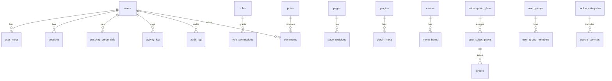

# 365CMS – Datenbank-Schema
> **Stand:** 2026-03-08 | **Version:** 2.5.4 | **Status:** Aktuell

## Inhaltsverzeichnis
- <a>Überblick</a>
- <a>Schema-Ebenen & Präfix</a>
- <a>Tabellen nach Domäne</a>
- <a>Feldbeschreibungen & Indizes</a>
- <a>Beziehungen (ER)</a>
- <a>Migrations-System</a>
- <a>Performance & Indizes</a>
- <a>Bekannte Besonderheiten</a>

---

## Überblick <!-- UPDATED: 2026-03-08 -->
365CMS nutzt ein relationelles Schema auf MySQL/MariaDB (InnoDB, `utf8mb4`). Basistabellen werden idempotent von `CMS\SchemaManager::createTables()` angelegt, erweiterte Tabellen entstehen durch Services oder Admin-Module (SEO, Redirects, Cookie-Consent, Firewall, Menüs etc.). `MigrationManager` hält inkrementelle Anpassungen synchron (aktuell `SCHEMA_VERSION = v14`).

---

## Schema-Ebenen & Präfix <!-- UPDATED: 2026-03-08 -->
- **Präfix**: konfigurierbar in `CMS/config/app.php` (`db_prefix`), in allen CREATE-Statements verwendet.
- **Ebenen**:
  - Core-Schema (SchemaManager, MigrationManager)
  - Feature-/Modul-Schema (Services & Admin-Module)
- **Installer**: `CMS/install.php` besitzt eigene Tabelleliste (muss mit SchemaManager synchron bleiben).

---

## Tabellen nach Domäne <!-- UPDATED: 2026-03-08 -->
- **core_ / user_**: `users`, `user_meta`, `roles`, `role_permissions`, `sessions`, `login_attempts`, `failed_logins`, `passkey_credentials`, `activity_log`, `audit_log`.
- **content_**: `pages`, `page_revisions`, `landing_sections`, `posts`, `post_categories`, `comments`, `media`, `custom_fonts`.
- **plugin_ / theme_**: `plugins`, `plugin_meta`, `theme_customizations`, `menus`, `menu_items`.
- **subscription_**: `subscription_plans`, `user_subscriptions`, `user_groups`, `user_group_members`, `subscription_usage`, `orders`.
- **seo_**: `seo_meta`, `redirect_rules`, `not_found_logs`.
- **log_ / security_**: `blocked_ips`, `firewall_rules`, `spam_blacklist`, `cookie_categories`, `cookie_services`, `privacy_requests`.
- **service_**: `settings`, `cache`, `mail_log`, `mail_queue`, `page_views`.
- **search**: (TNTSearch nutzt eigene Index-Dateien außerhalb der DB).

---

## Feldbeschreibungen & Indizes <!-- UPDATED: 2026-03-08 -->
Nachfolgend tabellarisch (Auszug pro Tabelle, alle Felder, Defaults, Indizes). `Nullable` = Ja/Nein.

### core/user
| Tabelle | Feld | Typ | Null | Default | Beschreibung |
|---|---|---|---|---|---|
| users | id (PK) | INT UNSIGNED | Nein | AUTO_INCREMENT | Primärschlüssel |
|  | username | VARCHAR(60) | Nein | – | Login-Name, UNIQUE, idx_username |
|  | email | VARCHAR(100) | Nein | – | E-Mail, UNIQUE, idx_email |
|  | password | VARCHAR(255) | Nein | – | Hash (bcrypt) |
|  | display_name | VARCHAR(100) | Nein | – | Anzeigename |
|  | role | VARCHAR(20) | Nein | 'member' | RBAC-Rolle, idx_role |
|  | status | VARCHAR(20) | Nein | 'active' | Account-Status |
|  | created_at | TIMESTAMP | Ja | CURRENT_TIMESTAMP | Anlagezeit |
|  | updated_at | TIMESTAMP | Ja | ON UPDATE | Änderungszeit |
|  | last_login | TIMESTAMP | Ja | NULL | Letzter Login |
| user_meta | id (PK) | BIGINT UNSIGNED | Nein | AI | |
|  | user_id | INT UNSIGNED | Nein | – | FK → users.id, idx_user_id |
|  | meta_key | VARCHAR(255) | Nein | – | Schlüssel, idx_meta_key |
|  | meta_value | LONGTEXT | Ja | NULL | Wert |
| roles | id (PK) | INT UNSIGNED | Nein | AI | |
|  | name | VARCHAR(50) | Nein | – | Maschinenname, UNIQUE |
|  | display_name | VARCHAR(100) | Nein | – | Anzeigename |
|  | description | TEXT | Ja | NULL | Beschreibung |
|  | capabilities | TEXT | Ja | NULL | JSON-Array |
|  | member_dashboard_access | TINYINT(1) | Nein | 1 | Zugriff Member-Dashboard |
|  | sort_order | INT | Nein | 0 | Sortierung |
|  | created_at / updated_at | TIMESTAMP | Ja | | Zeitstempel |
| role_permissions | id (PK) | BIGINT UNSIGNED | Nein | AI | |
|  | role_id | INT UNSIGNED | Nein | – | FK → roles.id |
|  | permission | VARCHAR(150) | Nein | – | Berechtigungsschlüssel |
|  | granted | TINYINT(1) | Nein | 1 | Erlaubt/Verboten |

### auth/session/security
| Tabelle | Feld | Typ | Null | Default | Beschreibung |
|---|---|---|---|---|---|
| sessions | id (PK) | VARCHAR(128) | Nein | – | Session-ID |
|  | user_id | INT UNSIGNED | Ja | NULL | User-Referenz, idx_user_id |
|  | ip_address | VARCHAR(45) | Ja | NULL | IP |
|  | user_agent | VARCHAR(255) | Ja | NULL | UA |
|  | payload | TEXT | Ja | NULL | Serialisierte Session |
|  | last_activity | TIMESTAMP | Nein | CURRENT_TIMESTAMP | idx_last_activity |
|  | expires_at | TIMESTAMP | Ja | NULL | idx_expires |
| login_attempts | id (PK) | BIGINT UNSIGNED | Nein | AI | |
|  | username | VARCHAR(60) | Ja | NULL | |
|  | ip_address | VARCHAR(45) | Ja | NULL | idx_ip |
|  | action | VARCHAR(30) | Nein | 'login' | Rate-Limit-Key, idx_action/idx_ip_action |
|  | attempted_at | TIMESTAMP | Nein | CURRENT_TIMESTAMP | idx_time |
| failed_logins | id (PK) | BIGINT UNSIGNED | Nein | AI | |
|  | username | VARCHAR(60) | Ja | NULL | |
|  | ip_address | VARCHAR(45) | Ja | NULL | |
|  | attempted_at | TIMESTAMP | Nein | CURRENT_TIMESTAMP | |
|  | user_agent | VARCHAR(255) | Ja | NULL | |
| passkey_credentials | id (PK) | INT UNSIGNED | Nein | AI | |
|  | user_id | INT UNSIGNED | Nein | – | idx_user |
|  | credential_id | VARCHAR(512) | Nein | – | UNIQUE(credential_id(255)) |
|  | public_key | TEXT | Nein | – | |
|  | sign_count | INT UNSIGNED | Nein | 0 | |
|  | aaguid | VARCHAR(64) | Ja | NULL | |
|  | attestation_fmt | VARCHAR(32) | Ja | NULL | |
|  | name | VARCHAR(128) | Ja | '' | Gerätebezeichnung |
|  | created_at | TIMESTAMP | Ja | CURRENT_TIMESTAMP | |
|  | last_used_at | TIMESTAMP | Ja | NULL | |
| blocked_ips | id (PK) | BIGINT UNSIGNED | Nein | AI | |
|  | ip_address | VARCHAR(45) | Nein | – | UNIQUE, idx_ip |
|  | reason | VARCHAR(255) | Ja | NULL | |
|  | expires_at | DATETIME | Ja | NULL | idx_expires |
|  | permanent | TINYINT(1) | Nein | 0 | |
|  | created_at | TIMESTAMP | Ja | CURRENT_TIMESTAMP | |

### audit/logging
| Tabelle | Feld | Typ | Null | Default | Beschreibung |
|---|---|---|---|---|---|
| activity_log | id (PK) | BIGINT UNSIGNED | Nein | AI | User-Aktivitäten |
|  | user_id | INT UNSIGNED | Ja | NULL | idx_user_id |
|  | action | VARCHAR(100) | Nein | – | idx_action |
|  | entity_type | VARCHAR(100) | Ja | NULL | idx_entity_type |
|  | entity_id | BIGINT UNSIGNED | Ja | NULL | idx_entity_id |
|  | description | TEXT | Ja | NULL | |
|  | ip_address | VARCHAR(45) | Ja | NULL | |
|  | user_agent | VARCHAR(500) | Ja | NULL | |
|  | metadata | LONGTEXT | Ja | NULL | JSON |
|  | created_at | TIMESTAMP | Ja | CURRENT_TIMESTAMP | idx_created_at |
| audit_log | id (PK) | BIGINT UNSIGNED | Nein | AI | Sicherheits-Audit |
|  | user_id | INT UNSIGNED | Ja | NULL | |
|  | category | VARCHAR(50) | Nein | – | idx_category |
|  | action | VARCHAR(100) | Nein | – | idx_action |
|  | entity_type | VARCHAR(100) | Ja | NULL | |
|  | entity_id | BIGINT UNSIGNED | Ja | NULL | |
|  | description | TEXT | Ja | NULL | |
|  | ip_address | VARCHAR(45) | Ja | NULL | |
|  | user_agent | VARCHAR(500) | Ja | NULL | |
|  | metadata | LONGTEXT | Ja | NULL | |
|  | severity | ENUM('info','warning','critical') | Nein | 'info' | idx_severity |
|  | created_at | TIMESTAMP | Ja | CURRENT_TIMESTAMP | idx_created_at |

### configuration/cache
| Tabelle | Feld | Typ | Null | Default | Beschreibung |
|---|---|---|---|---|---|
| settings | id (PK) | INT UNSIGNED | Nein | AI | |
|  | option_name | VARCHAR(255) | Nein | – | UNIQUE, idx_key |
|  | option_value | LONGTEXT | Ja | NULL | |
|  | autoload | TINYINT(1) | Ja | 1 | |
| cache | id (PK) | BIGINT UNSIGNED | Nein | AI | |
|  | cache_key | VARCHAR(191) | Nein | – | UNIQUE, idx_key |
|  | cache_value | LONGTEXT | Ja | NULL | |
|  | expires_at | TIMESTAMP | Ja | NULL | idx_expires |
|  | created_at | TIMESTAMP | Ja | CURRENT_TIMESTAMP | |

### content/pages/posts/media
| Tabelle | Feld | Typ | Null | Default | Beschreibung |
|---|---|---|---|---|---|
| pages | id (PK) | INT UNSIGNED | Nein | AI | |
|  | slug | VARCHAR(200) | Nein | – | UNIQUE, idx_slug |
|  | title | VARCHAR(255) | Nein | – | |
|  | content | LONGTEXT | Ja | NULL | |
|  | excerpt | TEXT | Ja | NULL | |
|  | status | VARCHAR(20) | Ja | 'draft' | idx_status |
|  | hide_title | TINYINT(1) | Nein | 0 | |
|  | featured_image | VARCHAR(500) | Ja | NULL | |
|  | meta_title | VARCHAR(255) | Ja | NULL | |
|  | meta_description | TEXT | Ja | NULL | |
|  | author_id | INT UNSIGNED | Ja | NULL | idx_author |
|  | created_at / updated_at / published_at | TIMESTAMP | Ja | | Zeitstempel, idx_published |
| page_revisions | id (PK) | BIGINT UNSIGNED | Nein | AI | |
|  | page_id | INT UNSIGNED | Nein | – | idx_page_id |
|  | title/content/excerpt | | Ja | | Revision |
|  | author_id | INT UNSIGNED | Ja | NULL | |
|  | created_at | TIMESTAMP | Ja | CURRENT_TIMESTAMP | |
| landing_sections | id (PK) | INT UNSIGNED | Nein | AI | |
|  | type | VARCHAR(50) | Nein | – | idx_type |
|  | data | TEXT | Ja | NULL | JSON |
|  | sort_order | INT | Ja | 0 | idx_order |
|  | created_at / updated_at | TIMESTAMP | Ja | | |
| posts | id (PK) | BIGINT UNSIGNED | Nein | AI | |
|  | title | VARCHAR(255) | Nein | – | |
|  | slug | VARCHAR(255) | Nein | – | UNIQUE, idx_slug |
|  | content / excerpt | | Ja | | |
|  | featured_image | VARCHAR(500) | Ja | NULL | |
|  | status | ENUM('draft','published','trash') | Nein | 'draft' | idx_status |
|  | author_id | INT UNSIGNED | Nein | – | idx_author |
|  | category_id | INT UNSIGNED | Ja | NULL | idx_category |
|  | tags | VARCHAR(500) | Ja | NULL | |
|  | views | INT UNSIGNED | Nein | 0 | |
|  | allow_comments | TINYINT(1) | Nein | 1 | |
|  | meta_title/meta_description | | Ja | | |
|  | created_at/updated_at/published_at | TIMESTAMP | Ja | | idx_published |
| post_categories | id (PK) | INT UNSIGNED | Nein | AI | |
|  | name | VARCHAR(100) | Nein | – | |
|  | slug | VARCHAR(100) | Nein | – | UNIQUE, idx_slug |
|  | description | TEXT | Ja | NULL | |
|  | parent_id | INT UNSIGNED | Ja | NULL | idx_parent |
|  | sort_order | INT | Ja | 0 | |
| comments | id (PK) | BIGINT UNSIGNED | Nein | AI | |
|  | post_id | BIGINT UNSIGNED | Nein | 0 | idx_post_id |
|  | user_id | INT UNSIGNED | Ja | NULL | idx_user_id |
|  | author / author_email / author_ip | | Ja | | |
|  | content | TEXT | Nein | – | |
|  | status | ENUM('pending','approved','spam','trash') | Nein | 'pending' | idx_status |
|  | post_date | TIMESTAMP | Ja | CURRENT_TIMESTAMP | idx_post_date |
|  | modified_at | TIMESTAMP | Ja | ON UPDATE | |
| media | id (PK) | BIGINT UNSIGNED | Nein | AI | |
|  | filename | VARCHAR(255) | Nein | – | |
|  | filepath | VARCHAR(500) | Nein | – | |
|  | filetype | VARCHAR(50) | Ja | NULL | idx_type |
|  | filesize | INT UNSIGNED | Ja | NULL | |
|  | title/alt_text/caption | | Ja | | |
|  | uploaded_by | INT UNSIGNED | Ja | NULL | idx_uploader |
|  | uploaded_at | TIMESTAMP | Ja | CURRENT_TIMESTAMP | |
| custom_fonts | id (PK) | INT UNSIGNED | Nein | AI | |
|  | name | VARCHAR(100) | Nein | – | |
|  | slug | VARCHAR(100) | Nein | – | UNIQUE |
|  | format | VARCHAR(20) | Nein | 'woff2' | |
|  | file_path | VARCHAR(500) | Nein | – | |
|  | css_path | VARCHAR(500) | Ja | NULL | |
|  | source | VARCHAR(50) | Nein | 'upload' | idx_source |
|  | created_at | TIMESTAMP | Ja | CURRENT_TIMESTAMP | |

### plugins & themes
| Tabelle | Feld | Typ | Null | Default | Beschreibung |
|---|---|---|---|---|---|
| plugins | id (PK) | INT UNSIGNED | Nein | AI | |
|  | name | VARCHAR(100) | Nein | – | UNIQUE |
|  | slug | VARCHAR(100) | Nein | – | UNIQUE, idx_slug |
|  | version | VARCHAR(20) | Nein | – | |
|  | author | VARCHAR(100) | Ja | NULL | |
|  | description | TEXT | Ja | NULL | |
|  | plugin_path | VARCHAR(255) | Nein | – | |
|  | is_active | TINYINT(1) | Ja | 0 | idx_active |
|  | auto_update | TINYINT(1) | Ja | 0 | |
|  | settings | LONGTEXT | Ja | NULL | JSON |
|  | timestamps | TIMESTAMP | Ja | | installed_at/updated_at/activated_at |
| plugin_meta | id (PK) | BIGINT UNSIGNED | Nein | AI | |
|  | plugin_id | INT UNSIGNED | Nein | – | FK → plugins.id |
|  | meta_key | VARCHAR(255) | Nein | – | |
|  | meta_value | LONGTEXT | Ja | NULL | |
| theme_customizations | id (PK) | BIGINT UNSIGNED | Nein | AI | |
|  | theme_slug | VARCHAR(100) | Nein | – | idx_theme_slug |
|  | setting_category | VARCHAR(100) | Nein | – | idx_category |
|  | setting_key | VARCHAR(255) | Nein | – | idx_key |
|  | setting_value | LONGTEXT | Ja | NULL | |
|  | user_id | INT UNSIGNED | Ja | NULL | idx_user_id |
|  | created_at/updated_at | TIMESTAMP | Ja | | UNIQUE (theme_slug, setting_category, setting_key, user_id) |
| menus | id (PK) | INT UNSIGNED | Nein | AI | |
|  | name | VARCHAR(150) | Nein | – | |
|  | slug | VARCHAR(150) | Nein | – | UNIQUE |
|  | location | VARCHAR(100) | Ja | NULL | |
|  | description | TEXT | Ja | NULL | |
| menu_items | id (PK) | INT UNSIGNED | Nein | AI | |
|  | menu_id | INT UNSIGNED | Nein | – | FK → menus.id |
|  | parent_id | INT UNSIGNED | Ja | NULL | |
|  | title | VARCHAR(255) | Nein | – | |
|  | url | VARCHAR(500) | Nein | – | |
|  | target | VARCHAR(20) | Ja | NULL | |
|  | sort_order | INT | Ja | 0 | |
|  | is_active | TINYINT(1) | Ja | 1 | |

### subscription & commerce
| Tabelle | Feld | Typ | Null | Default | Beschreibung |
|---|---|---|---|---|---|
| subscription_plans | id (PK) | INT | Nein | AI | |
|  | name/slug | VARCHAR(100) | Nein | – | slug UNIQUE |
|  | description | TEXT | Ja | NULL | |
|  | price_monthly/price_yearly | DECIMAL(10,2) | Ja | 0.00 | |
|  | limit_experts/companies/events/speakers/storage_mb | INT | Ja | -1/1000 | Kontingente |
|  | feature_* | BOOLEAN | Ja | 0/1 | Feature-Flags |
|  | is_active | BOOLEAN | Ja | 1 | idx_active |
|  | sort_order | INT | Ja | 0 | idx_sort |
|  | timestamps | TIMESTAMP | Ja | | |
| user_subscriptions | id (PK) | INT | Nein | AI | |
|  | user_id | INT UNSIGNED | Nein | – | idx_user_id |
|  | plan_id | INT | Nein | – | idx_plan_id |
|  | status | ENUM('active','cancelled','expired','trial','suspended') | Ja | 'active' | |
|  | billing_cycle | ENUM('monthly','yearly','lifetime') | Ja | 'monthly' | |
|  | start_date/end_date/next_billing/cancelled_at | DATETIME | Ja | NULL | |
|  | created_at/updated_at | TIMESTAMP | Ja | | |
| user_groups | id (PK) | INT | Nein | AI | |
|  | name/slug | VARCHAR(100) | Nein | – | slug UNIQUE |
|  | description | TEXT | Ja | NULL | |
|  | role_id | INT UNSIGNED | Ja | NULL | |
|  | plan_id | INT | Ja | NULL | |
|  | is_active | BOOLEAN | Ja | 1 | |
|  | timestamps | TIMESTAMP | Ja | | |
| user_group_members | id (PK) | INT | Nein | AI | |
|  | user_id | INT UNSIGNED | Nein | – | idx_user_id |
|  | group_id | INT | Nein | – | idx_group_id |
|  | joined_at | TIMESTAMP | Ja | CURRENT_TIMESTAMP | UNIQUE(user_id, group_id) |
| subscription_usage | id (PK) | INT | Nein | AI | |
|  | user_id | INT UNSIGNED | Nein | – | idx_user_id |
|  | resource_type | VARCHAR(50) | Nein | – | idx_resource |
|  | current_count | INT | Ja | 0 | |
|  | last_updated | TIMESTAMP | Ja | ON UPDATE | |
| orders | id (PK) | BIGINT UNSIGNED | Nein | AI | |
|  | order_number | VARCHAR(64) | Nein | – | UNIQUE, idx_order_number |
|  | user_id | INT UNSIGNED | Ja | NULL | idx_user_id |
|  | plan_id | INT | Nein | – | idx_plan_id |
|  | status | ENUM('pending','confirmed','cancelled','refunded') | Ja | 'pending' | idx_status |
|  | total_amount | DECIMAL(10,2) | Nein | 0.00 | |
|  | currency | VARCHAR(3) | Ja | 'EUR' | |
|  | payment_method | VARCHAR(50) | Ja | NULL | |
|  | billing_cycle | ENUM('monthly','yearly','lifetime') | Ja | 'monthly' | |
|  | customer fields | VARCHAR | Ja | NULL | Name, Adresse, Kontakt |
|  | created_at/updated_at | TIMESTAMP | Ja | | idx_created_at |

### seo & redirects
| Tabelle | Feld | Typ | Null | Default | Beschreibung |
|---|---|---|---|---|---|
| seo_meta | id (PK) | BIGINT UNSIGNED | Nein | AI | |
|  | entity_type | VARCHAR(50) | Nein | – | idx_entity_type |
|  | entity_id | BIGINT UNSIGNED | Nein | – | idx_entity_id |
|  | meta_title/meta_description | TEXT | Ja | NULL | |
|  | canonical_url | VARCHAR(500) | Ja | NULL | |
|  | og_title/og_description/og_image | | Ja | NULL | |
|  | robots | VARCHAR(50) | Ja | NULL | |
|  | json_ld | LONGTEXT | Ja | NULL | |
| redirect_rules | id (PK) | BIGINT UNSIGNED | Nein | AI | |
|  | source_path | VARCHAR(500) | Nein | – | idx_source_path |
|  | target_path | VARCHAR(500) | Nein | – | |
|  | status_code | INT | Ja | 301 | |
|  | hits | INT | Ja | 0 | |
|  | is_active | TINYINT(1) | Ja | 1 | idx_active |
|  | created_at/updated_at | TIMESTAMP | Ja | | |
| not_found_logs | id (PK) | BIGINT UNSIGNED | Nein | AI | |
|  | path | VARCHAR(500) | Nein | – | |
|  | referrer | VARCHAR(500) | Ja | NULL | |
|  | user_agent | VARCHAR(500) | Ja | NULL | |
|  | ip_address | VARCHAR(45) | Ja | NULL | |
|  | created_at | TIMESTAMP | Ja | CURRENT_TIMESTAMP | |

### consent/legal/security modules
| Tabelle | Feld | Typ | Null | Default | Beschreibung |
|---|---|---|---|---|---|
| cookie_categories | id (PK) | INT UNSIGNED | Nein | AI | |
|  | name | VARCHAR(150) | Nein | – | |
|  | slug | VARCHAR(150) | Nein | – | UNIQUE |
|  | description | TEXT | Ja | NULL | |
|  | is_active | TINYINT(1) | Ja | 1 | |
| cookie_services | id (PK) | INT UNSIGNED | Nein | AI | |
|  | category_id | INT UNSIGNED | Nein | – | FK → cookie_categories.id |
|  | name | VARCHAR(150) | Nein | – | |
|  | provider | VARCHAR(150) | Ja | NULL | |
|  | purpose | TEXT | Ja | NULL | |
|  | privacy_url | VARCHAR(500) | Ja | NULL | |
|  | host | VARCHAR(255) | Ja | NULL | |
|  | duration | VARCHAR(50) | Ja | NULL | |
|  | is_active | TINYINT(1) | Ja | 1 | |
| privacy_requests | id (PK) | BIGINT UNSIGNED | Nein | AI | |
|  | request_type | ENUM('access','erasure','rectification') | Nein | 'access' | |
|  | email | VARCHAR(255) | Nein | – | |
|  | status | ENUM('open','in_progress','closed') | Nein | 'open' | |
|  | payload | LONGTEXT | Ja | NULL | |
|  | created_at/updated_at | TIMESTAMP | Ja | | |
| firewall_rules | id (PK) | BIGINT UNSIGNED | Nein | AI | |
|  | pattern | VARCHAR(255) | Nein | – | |
|  | action | ENUM('allow','block','captcha') | Nein | 'block' | |
|  | priority | INT | Ja | 0 | |
|  | is_active | TINYINT(1) | Ja | 1 | |
| spam_blacklist | id (PK) | BIGINT UNSIGNED | Nein | AI | |
|  | value | VARCHAR(255) | Nein | – | |
|  | type | ENUM('ip','email','keyword') | Nein | 'ip' | |
|  | reason | VARCHAR(255) | Ja | NULL | |
|  | expires_at | DATETIME | Ja | NULL | |
|  | is_active | TINYINT(1) | Ja | 1 | |

### services & mail
| Tabelle | Feld | Typ | Null | Default | Beschreibung |
|---|---|---|---|---|---|
| mail_log | id (PK) | BIGINT UNSIGNED | Nein | AI | Versand-Historie |
|  | recipient | VARCHAR(255) | Nein | – | idx_recipient |
|  | subject | VARCHAR(255) | Nein | – | |
|  | status | ENUM('sent','failed') | Nein | 'sent' | idx_status |
|  | transport | VARCHAR(50) | Nein | 'smtp' | |
|  | provider | VARCHAR(50) | Nein | 'default' | |
|  | message_id | VARCHAR(255) | Ja | NULL | |
|  | error_message | TEXT | Ja | NULL | |
|  | meta | LONGTEXT | Ja | NULL | |
|  | source | VARCHAR(100) | Nein | 'system' | idx_source |
|  | created_at | TIMESTAMP | Ja | CURRENT_TIMESTAMP | idx_created_at |
| mail_queue | id (PK) | BIGINT UNSIGNED | Nein | AI | |
|  | recipient/subject/body/headers/content_type/source | | | | |
|  | status | ENUM('pending','processing','sent','failed') | Nein | 'pending' | idx_status |
|  | attempts/max_attempts | INT UNSIGNED | Nein | 0/5 | |
|  | available_at/sent_at/locked_at/last_attempt_at | DATETIME | Ja | NULL | |
|  | attachment_* | VARCHAR | Ja | NULL | |
|  | error_category/last_error | | Ja | NULL | |
|  | created_at/updated_at | TIMESTAMP | Ja | | |
| page_views | id (PK) | BIGINT UNSIGNED | Nein | AI | |
|  | page_id | INT UNSIGNED | Ja | NULL | idx_page_id |
|  | page_slug/page_title | VARCHAR | Ja | NULL | |
|  | user_id | INT UNSIGNED | Ja | NULL | idx_user_id |
|  | session_id | VARCHAR(128) | Ja | NULL | idx_session_id |
|  | ip_address | VARCHAR(45) | Ja | NULL | |
|  | user_agent | VARCHAR(500) | Ja | NULL | |
|  | referrer | VARCHAR(500) | Ja | NULL | |
|  | visited_at | TIMESTAMP | Ja | CURRENT_TIMESTAMP | idx_visited_at/idx_date |

---

## Beziehungen (ER) <!-- UPDATED: 2026-03-08 -->
Mermaid (vereinfacht, wichtigste FKs):


---

## Migrations-System <!-- UPDATED: 2026-03-08 -->
- **SchemaManager::createTables()**: legt Tabellen via `CREATE TABLE IF NOT EXISTS` an.
- **MigrationManager::run()**: prüft `SCHEMA_VERSION` (v14) und ergänzt Spalten/Tabellen idempotent (z. B. passkey_credentials, mail_log/-queue).
- **Installer (`install.php`)**: besitzt separate `createDatabaseTables()`-Liste; bei Änderungen beide Orte synchronisieren.
- **ensureContentColumns()**: fügt fehlende SEO/Media-Spalten in `pages`/`posts` bei Altinstallationen hinzu.
- **Reparatur**: `Database::repairTables()` ruft SchemaManager und MigrationManager erneut auf; Flag-Datei unter `cache/db_schema_v14.flag`.

---

## Performance & Indizes <!-- UPDATED: 2026-03-08 -->
- Häufige Suchfelder sind indiziert: `slug`, `status`, `author_id`, `created_at/published_at`, `ip_address`, `action`, `resource_type`.
- Eindeutige Keys: `users.username`, `users.email`, `pages.slug`, `posts.slug`, `order_number`, `passkey_credentials.credential_id(255)`, `cookie_categories.slug`, `menus.slug`, `menu_items.id`.
- Cache/Session: `cache.expires_at`, `sessions.expires_at` für TTL-Löschung.
- Mail-Queue: Kombi-Index `(status, available_at)` für Worker-Pulls.

---

## Bekannte Besonderheiten <!-- UPDATED: 2026-03-08 -->
- `orders.plan_id` ist kanonisch; `package_id` nur legacy-kompatibel in Alt-Dumps.
- Admin-Diagnose für Cron sucht `cron.php` und `cms_cron_*` literal in Dateien.
- Vendor-Assets liegen produktiv unter `CMS/assets/`; DB-Integrationen (Mail, SEO, Suche) nutzen Klassen aus diesem Pfad.
- HTMLPurifier/Security: Sanitization über Services, nicht durch DB-Constraints. Referentielle Integrität wird teils logisch (nicht immer FK) abgesichert.
| `user_subscriptions` | Benutzerabos |
| `user_groups` | Gruppen |
| `user_group_members` | Gruppenzuordnungen |
| `subscription_usage` | Nutzungszähler |
| `post_categories` | Kategorien |
| `posts` | Beiträge |
| `orders` | Bestellungen |
| `blocked_ips` | blockierte IPs |
| `failed_logins` | Fehlanmeldungen |
| `media` | Medienbibliothek |
| `page_views` | Analytics / Aufrufe |
| `comments` | Kommentare |
| `messages` | Member-Nachrichten |
| `audit_log` | sicherheits- und adminrelevante Audits |
| `custom_fonts` | lokal verwaltete Webfonts |

---

## Zusätzliche Modultabellen

| Tabelle | Erzeuger |
|---|---|
| `seo_meta` | `SEOService` |
| `redirect_rules` | `RedirectService` |
| `not_found_logs` | `RedirectService` |
| `cookie_categories` | Cookie-Manager |
| `cookie_services` | Cookie-Manager |
| `privacy_requests` | Privacy-/Deletion-Module |
| `firewall_rules` | Firewall-Modul |
| `spam_blacklist` | AntiSpam-Modul |
| `role_permissions` | Rollen-/Rechte-Modul |
| `menus` | Menu-Editor |
| `menu_items` | Menu-Editor |

---

## Wichtige Modellhinweise

### Bestellungen

Im aktuellen Schema ist für Bestellungen `plan_id` maßgeblich. Ältere Bezeichnungen wie `package_id` gelten nur als Legacy-Kontext.

### Theme-Anpassungen

Die Tabelle `theme_customizations` nutzt heute präzisere Feldnamen wie `theme_slug`, `setting_category`, `setting_key` und `setting_value`.

### Auditierung

`audit_log` ergänzt das generischere `activity_log` um Kategorien, Schweregrad und sicherheitsrelevante Metadaten.

---

## Zugriffsregeln für Entwicklerdokumentation

Für Datenbankbeispiele gilt in diesem Projekt:

- `Database::query()` ist für rohe SQL-Ausführung gedacht
- parametrisierte Statements laufen über `prepare()`/`execute()` oder passende Helper

Beispiel zum Lesen eines Settings:

```php
$value = $db->get_var(
    "SELECT option_value FROM {$p}settings WHERE option_name = ?",
    ['active_theme']
);
```

Beispiel für parametrisierte Ausführung:

```php
$db->execute(
    "INSERT INTO {$p}settings (option_name, option_value) VALUES (?, ?)
     ON DUPLICATE KEY UPDATE option_value = VALUES(option_value)",
    ['active_theme', 'cms-default']
);
```
