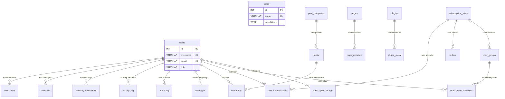

# 365CMS – Datenbankschema
> **Stand:** 2026-03-08 | **Version:** 2.5.4 | **Status:** Aktuell

## Inhaltsverzeichnis
- [Überblick](#überblick)
- [Schema-Übersicht nach Bereichen](#schema-übersicht-nach-bereichen)
- [Core-Tabellen](#core-tabellen)
- [Content-Tabellen](#content-tabellen)
- [User-Tabellen](#user-tabellen)
- [Plugin-Tabellen](#plugin-tabellen)
- [SEO-Tabellen](#seo-tabellen)
- [Subscription-Tabellen](#subscription-tabellen)
- [Log-Tabellen](#log-tabellen)
- [Beziehungen (ER-Diagramm)](#beziehungen)
- [Indizes und Performance](#indizes-und-performance)
- [Migrations-System](#migrations-system)

---

## Überblick <!-- UPDATED: 2026-03-08 -->

365CMS nutzt ein relationales Schema auf **MySQL / MariaDB** (Engine: InnoDB, Charset: `utf8mb4`).
Alle Tabellen verwenden einen konfigurierbaren Präfix (Standard: `cms_`), definiert in `CMS/config/app.php` als `DB_PREFIX`.

| Eigenschaft | Wert |
|---|---|
| Engine | InnoDB |
| Charset | utf8mb4 |
| Tabellen-Präfix | konfigurierbar (`cms_` Standard) |
| Schema-Version (SchemaManager) | `v14` |
| Schema-Version (MigrationManager) | `v11` |
| Anzahl Core-Tabellen | 33 |

Die Tabellenerstellung erfolgt über zwei zentrale Klassen:

- **`CMS\SchemaManager`** – idempotente Erstellung aller Tabellen via `CREATE TABLE IF NOT EXISTS`. Wird beim ersten Request ausgeführt und über eine Flag-Datei (`cache/db_schema_v14.flag`) gesteuert.
- **`CMS\MigrationManager`** – inkrementelle Schema-Migrationen (ALTER TABLE, neue Spalten/Indizes). Versioniert über `cms_settings.db_schema_version`.

Zusätzlich existiert eine separate Tabellenliste in `CMS/install.php` (`createDatabaseTables()`), die bei Neuinstallationen verwendet wird und mit dem SchemaManager synchron gehalten werden muss.

---

## Schema-Übersicht nach Bereichen <!-- UPDATED: 2026-03-08 -->

| Bereich | Tabellen |
|---|---|
| **Core** | `settings`, `cache`, `sessions` |
| **Content** | `pages`, `page_revisions`, `landing_sections`, `posts`, `post_categories`, `comments`, `media`, `custom_fonts`, `messages` |
| **User** | `users`, `user_meta`, `roles`, `passkey_credentials` |
| **Plugin / Theme** | `plugins`, `plugin_meta`, `theme_customizations` |
| **Subscription** | `subscription_plans`, `user_subscriptions`, `user_groups`, `user_group_members`, `subscription_usage`, `orders` |
| **Log / Security** | `activity_log`, `audit_log`, `login_attempts`, `failed_logins`, `blocked_ips`, `page_views`, `mail_log`, `mail_queue` |
| **Modul-Tabellen** *(Service-erzeugt)* | `seo_meta`, `redirect_rules`, `not_found_logs`, `cookie_categories`, `cookie_services`, `privacy_requests`, `firewall_rules`, `spam_blacklist`, `role_permissions`, `menus`, `menu_items` |

---

## Core-Tabellen <!-- UPDATED: 2026-03-08 -->

### `cms_settings` – Systemeinstellungen (Key-Value-Store)

Speichert alle CMS-Konfigurationswerte, Plugin-Einstellungen und die Schema-Version.

| Feldname | Typ | Nullable | Default | Beschreibung |
|---|---|---|---|---|
| `id` | INT UNSIGNED | Nein | AUTO_INCREMENT | Primärschlüssel |
| `option_name` | VARCHAR(255) | Nein | – | Eindeutiger Schlüsselname (UNIQUE) |
| `option_value` | LONGTEXT | Ja | NULL | Gespeicherter Wert (ggf. serialisiert/JSON) |
| `autoload` | TINYINT(1) | Ja | 1 | Bei Seitenaufruf automatisch laden |

**Indizes:** `idx_key (option_name)`, `UNIQUE (option_name)`

```sql
CREATE TABLE IF NOT EXISTS cms_settings (
    id INT UNSIGNED AUTO_INCREMENT PRIMARY KEY,
    option_name VARCHAR(255) NOT NULL UNIQUE,
    option_value LONGTEXT,
    autoload TINYINT(1) DEFAULT 1,
    INDEX idx_key (option_name)
) ENGINE=InnoDB DEFAULT CHARSET=utf8mb4;
```

### `cms_cache` – Datenbank-Cache

Temporäre Zwischenspeicherung mit TTL-Ablauf.

| Feldname | Typ | Nullable | Default | Beschreibung |
|---|---|---|---|---|
| `id` | BIGINT UNSIGNED | Nein | AUTO_INCREMENT | Primärschlüssel |
| `cache_key` | VARCHAR(191) | Nein | – | Cache-Schlüssel (UNIQUE) |
| `cache_value` | LONGTEXT | Ja | NULL | Gespeicherter Wert |
| `expires_at` | TIMESTAMP | Ja | NULL | Ablaufzeitpunkt |
| `created_at` | TIMESTAMP | Ja | CURRENT_TIMESTAMP | Erstellungszeitpunkt |

**Indizes:** `idx_key (cache_key)`, `idx_expires (expires_at)`, `UNIQUE (cache_key)`

```sql
CREATE TABLE IF NOT EXISTS cms_cache (
    id BIGINT UNSIGNED AUTO_INCREMENT PRIMARY KEY,
    cache_key VARCHAR(191) NOT NULL UNIQUE,
    cache_value LONGTEXT,
    expires_at TIMESTAMP NULL,
    created_at TIMESTAMP DEFAULT CURRENT_TIMESTAMP,
    INDEX idx_key (cache_key),
    INDEX idx_expires (expires_at)
) ENGINE=InnoDB DEFAULT CHARSET=utf8mb4;
```

### `cms_sessions` – Benutzersitzungen

Serverseitige Session-Verwaltung mit Ablaufsteuerung.

| Feldname | Typ | Nullable | Default | Beschreibung |
|---|---|---|---|---|
| `id` | VARCHAR(128) | Nein | – | Session-ID (Primärschlüssel) |
| `user_id` | INT UNSIGNED | Ja | NULL | Referenz auf Benutzer |
| `ip_address` | VARCHAR(45) | Ja | NULL | IPv4/IPv6-Adresse |
| `user_agent` | VARCHAR(255) | Ja | NULL | Browser User-Agent |
| `payload` | TEXT | Ja | NULL | Serialisierte Session-Daten |
| `last_activity` | TIMESTAMP | Nein | CURRENT_TIMESTAMP | Letzte Aktivität |
| `expires_at` | TIMESTAMP | Ja | NULL | Ablaufzeitpunkt |

**Indizes:** `idx_user_id (user_id)`, `idx_last_activity (last_activity)`, `idx_expires (expires_at)`

---

## Content-Tabellen <!-- UPDATED: 2026-03-08 -->

### `cms_pages` – Statische Seiten

CMS-Seiten mit SEO-Feldern, Revisionen und Featured-Image-Unterstützung.

| Feldname | Typ | Nullable | Default | Beschreibung |
|---|---|---|---|---|
| `id` | INT UNSIGNED | Nein | AUTO_INCREMENT | Primärschlüssel |
| `slug` | VARCHAR(200) | Nein | – | URL-Slug (UNIQUE) |
| `title` | VARCHAR(255) | Nein | – | Seitentitel |
| `content` | LONGTEXT | Ja | NULL | HTML-Inhalt |
| `excerpt` | TEXT | Ja | NULL | Kurzfassung |
| `status` | VARCHAR(20) | Ja | 'draft' | Veröffentlichungsstatus |
| `hide_title` | TINYINT(1) | Nein | 0 | Titel im Frontend ausblenden |
| `featured_image` | VARCHAR(500) | Ja | NULL | Pfad zum Beitragsbild |
| `meta_title` | VARCHAR(255) | Ja | NULL | SEO-Titel |
| `meta_description` | TEXT | Ja | NULL | SEO-Beschreibung |
| `author_id` | INT UNSIGNED | Ja | NULL | Autor (Referenz auf users.id) |
| `created_at` | TIMESTAMP | Ja | CURRENT_TIMESTAMP | Erstellungszeitpunkt |
| `updated_at` | TIMESTAMP | Ja | ON UPDATE | Änderungszeitpunkt |
| `published_at` | TIMESTAMP | Ja | NULL | Veröffentlichungszeitpunkt |

**Indizes:** `idx_slug (slug)`, `idx_status (status)`, `idx_author (author_id)`, `UNIQUE (slug)`

### `cms_page_revisions` – Seitenversionen

Versionierung von Seitenänderungen; verknüpft via FK mit `pages`.

| Feldname | Typ | Nullable | Default | Beschreibung |
|---|---|---|---|---|
| `id` | BIGINT UNSIGNED | Nein | AUTO_INCREMENT | Primärschlüssel |
| `page_id` | INT UNSIGNED | Nein | – | FK → pages.id (CASCADE) |
| `title` | VARCHAR(255) | Nein | – | Titel der Revision |
| `content` | LONGTEXT | Ja | NULL | HTML-Inhalt |
| `excerpt` | TEXT | Ja | NULL | Kurzfassung |
| `author_id` | INT UNSIGNED | Ja | NULL | Autor der Änderung |
| `created_at` | TIMESTAMP | Ja | CURRENT_TIMESTAMP | Erstellungszeitpunkt |

**Indizes:** `idx_page_id (page_id)`, `idx_author (author_id)`, `idx_created_at (created_at)`
**Foreign Keys:** `page_id → pages(id) ON DELETE CASCADE`

### `cms_landing_sections` – Landing-Page-Abschnitte

JSON-basierte Konfiguration für Landing-Page-Sektionen (Header, Features, Footer, Design).

| Feldname | Typ | Nullable | Default | Beschreibung |
|---|---|---|---|---|
| `id` | INT UNSIGNED | Nein | AUTO_INCREMENT | Primärschlüssel |
| `type` | VARCHAR(50) | Nein | – | Sektionstyp (header, feature, content, footer, design) |
| `data` | TEXT | Ja | NULL | JSON-kodierte Konfiguration |
| `sort_order` | INT | Ja | 0 | Anzeigereihenfolge |
| `created_at` | TIMESTAMP | Ja | CURRENT_TIMESTAMP | Erstellungszeitpunkt |
| `updated_at` | TIMESTAMP | Ja | ON UPDATE | Änderungszeitpunkt |

**Indizes:** `idx_type (type)`, `idx_order (sort_order)`

### `cms_posts` – Blog-Beiträge

Blog-System mit Kategorien, Tags, View-Counter und Kommentar-Steuerung.

| Feldname | Typ | Nullable | Default | Beschreibung |
|---|---|---|---|---|
| `id` | BIGINT UNSIGNED | Nein | AUTO_INCREMENT | Primärschlüssel |
| `title` | VARCHAR(255) | Nein | – | Beitragstitel |
| `slug` | VARCHAR(255) | Nein | – | URL-Slug (UNIQUE) |
| `content` | LONGTEXT | Ja | NULL | HTML-Inhalt |
| `excerpt` | TEXT | Ja | NULL | Kurzfassung |
| `featured_image` | VARCHAR(500) | Ja | NULL | Pfad zum Beitragsbild |
| `status` | ENUM('draft','published','trash') | Nein | 'draft' | Veröffentlichungsstatus |
| `author_id` | INT UNSIGNED | Nein | – | Autor (Referenz auf users.id) |
| `category_id` | INT UNSIGNED | Ja | NULL | FK → post_categories.id |
| `tags` | VARCHAR(500) | Ja | NULL | Kommagetrennte Tags |
| `views` | INT UNSIGNED | Ja | 0 | Aufrufzähler |
| `allow_comments` | TINYINT(1) | Nein | 1 | Kommentare erlauben |
| `meta_title` | VARCHAR(255) | Ja | NULL | SEO-Titel |
| `meta_description` | TEXT | Ja | NULL | SEO-Beschreibung |
| `created_at` | TIMESTAMP | Ja | CURRENT_TIMESTAMP | Erstellungszeitpunkt |
| `updated_at` | TIMESTAMP | Ja | ON UPDATE | Änderungszeitpunkt |
| `published_at` | TIMESTAMP | Ja | NULL | Veröffentlichungszeitpunkt |

**Indizes:** `idx_slug`, `idx_status`, `idx_author`, `idx_category`, `idx_published`

### `cms_post_categories` – Blog-Kategorien

Hierarchische Kategorien für Blog-Beiträge (Self-Referencing via `parent_id`).

| Feldname | Typ | Nullable | Default | Beschreibung |
|---|---|---|---|---|
| `id` | INT UNSIGNED | Nein | AUTO_INCREMENT | Primärschlüssel |
| `name` | VARCHAR(100) | Nein | – | Kategoriename |
| `slug` | VARCHAR(100) | Nein | – | URL-Slug (UNIQUE) |
| `description` | TEXT | Ja | NULL | Beschreibung |
| `parent_id` | INT UNSIGNED | Ja | NULL | Übergeordnete Kategorie |
| `sort_order` | INT | Ja | 0 | Sortierung |
| `created_at` | TIMESTAMP | Ja | CURRENT_TIMESTAMP | Erstellungszeitpunkt |

**Indizes:** `idx_slug (slug)`, `idx_parent (parent_id)`, `UNIQUE (slug)`

### `cms_comments` – Kommentare

Kommentarsystem für Blog-Beiträge mit Moderationsstatus.

| Feldname | Typ | Nullable | Default | Beschreibung |
|---|---|---|---|---|
| `id` | BIGINT UNSIGNED | Nein | AUTO_INCREMENT | Primärschlüssel |
| `post_id` | BIGINT UNSIGNED | Nein | 0 | Referenz auf posts.id |
| `user_id` | INT UNSIGNED | Ja | NULL | Eingeloggter Autor (optional) |
| `author` | VARCHAR(100) | Nein | '' | Gastautor-Name |
| `author_email` | VARCHAR(150) | Nein | '' | Gastautor-E-Mail |
| `author_ip` | VARCHAR(45) | Ja | '' | IP-Adresse des Autors |
| `content` | TEXT | Nein | – | Kommentartext |
| `status` | ENUM('pending','approved','spam','trash') | Nein | 'pending' | Moderationsstatus |
| `post_date` | TIMESTAMP | Ja | CURRENT_TIMESTAMP | Erstellungszeitpunkt |
| `modified_at` | TIMESTAMP | Ja | ON UPDATE | Änderungszeitpunkt |

**Indizes:** `idx_post_id`, `idx_status`, `idx_post_date`, `idx_user_id`

### `cms_media` – Medienbibliothek

Verwaltung hochgeladener Dateien (Bilder, Dokumente, Assets).

| Feldname | Typ | Nullable | Default | Beschreibung |
|---|---|---|---|---|
| `id` | BIGINT UNSIGNED | Nein | AUTO_INCREMENT | Primärschlüssel |
| `filename` | VARCHAR(255) | Nein | – | Dateiname |
| `filepath` | VARCHAR(500) | Nein | – | Relativer Pfad im Dateisystem |
| `filetype` | VARCHAR(50) | Ja | NULL | MIME-Typ |
| `filesize` | INT UNSIGNED | Ja | NULL | Dateigröße in Bytes |
| `title` | VARCHAR(255) | Ja | NULL | Titel |
| `alt_text` | VARCHAR(255) | Ja | NULL | Alternativtext (Barrierefreiheit) |
| `caption` | TEXT | Ja | NULL | Bildunterschrift |
| `uploaded_by` | INT UNSIGNED | Ja | NULL | Hochgeladen von (User-ID) |
| `uploaded_at` | TIMESTAMP | Ja | CURRENT_TIMESTAMP | Upload-Zeitpunkt |

**Indizes:** `idx_type (filetype)`, `idx_uploader (uploaded_by)`

### `cms_custom_fonts` – Benutzerdefinierte Schriftarten

Lokal verwaltete Webfonts (Upload oder lokal gespeicherte Google Fonts).

| Feldname | Typ | Nullable | Default | Beschreibung |
|---|---|---|---|---|
| `id` | INT UNSIGNED | Nein | AUTO_INCREMENT | Primärschlüssel |
| `name` | VARCHAR(100) | Nein | – | Schriftart-Name |
| `slug` | VARCHAR(100) | Nein | – | URL-Slug (UNIQUE) |
| `format` | VARCHAR(20) | Nein | 'woff2' | Dateiformat |
| `file_path` | VARCHAR(500) | Nein | – | Pfad zur Font-Datei |
| `css_path` | VARCHAR(500) | Ja | NULL | Pfad zur CSS-Datei |
| `source` | VARCHAR(50) | Nein | 'upload' | Quelle: upload oder google-fonts-local |
| `created_at` | TIMESTAMP | Ja | CURRENT_TIMESTAMP | Erstellungszeitpunkt |

**Indizes:** `idx_slug (slug) UNIQUE`, `idx_source (source)`

### `cms_messages` – Interne Nachrichten (Member-Dashboard)

Nachrichtensystem zwischen Mitgliedern mit Thread-Unterstützung.

| Feldname | Typ | Nullable | Default | Beschreibung |
|---|---|---|---|---|
| `id` | BIGINT UNSIGNED | Nein | AUTO_INCREMENT | Primärschlüssel |
| `sender_id` | INT UNSIGNED | Nein | – | FK → users.id (CASCADE) |
| `recipient_id` | INT UNSIGNED | Nein | – | FK → users.id (CASCADE) |
| `subject` | VARCHAR(255) | Nein | '' | Betreff |
| `body` | TEXT | Nein | – | Nachrichtentext |
| `is_read` | TINYINT(1) | Nein | 0 | Gelesen-Status |
| `read_at` | TIMESTAMP | Ja | NULL | Gelesen-Zeitpunkt |
| `parent_id` | BIGINT UNSIGNED | Ja | NULL | Thread-Root-ID für Antworten |
| `deleted_by_sender` | TINYINT(1) | Nein | 0 | Vom Sender gelöscht |
| `deleted_by_recipient` | TINYINT(1) | Nein | 0 | Vom Empfänger gelöscht |
| `created_at` | TIMESTAMP | Ja | CURRENT_TIMESTAMP | Erstellungszeitpunkt |

**Indizes:** `idx_sender`, `idx_recipient`, `idx_parent`, `idx_is_read`, `idx_created_at`
**Foreign Keys:** `sender_id → users(id) ON DELETE CASCADE`, `recipient_id → users(id) ON DELETE CASCADE`

---

## User-Tabellen <!-- UPDATED: 2026-03-08 -->

### `cms_users` – Benutzerkonten

Zentrale Benutzertabelle mit Rollen-Zuordnung und Statusverwaltung.

| Feldname | Typ | Nullable | Default | Beschreibung |
|---|---|---|---|---|
| `id` | INT UNSIGNED | Nein | AUTO_INCREMENT | Primärschlüssel |
| `username` | VARCHAR(60) | Nein | – | Login-Name (UNIQUE) |
| `email` | VARCHAR(100) | Nein | – | E-Mail-Adresse (UNIQUE) |
| `password` | VARCHAR(255) | Nein | – | Passwort-Hash (bcrypt, cost 12) |
| `display_name` | VARCHAR(100) | Nein | – | Öffentlicher Anzeigename |
| `role` | VARCHAR(20) | Nein | 'member' | RBAC-Rolle (admin, editor, member, …) |
| `status` | VARCHAR(20) | Nein | 'active' | Kontostatus (active, suspended, …) |
| `created_at` | TIMESTAMP | Ja | CURRENT_TIMESTAMP | Registrierungszeitpunkt |
| `updated_at` | TIMESTAMP | Ja | ON UPDATE | Letzte Änderung |
| `last_login` | TIMESTAMP | Ja | NULL | Zeitpunkt des letzten Logins |

**Indizes:** `idx_username (username)`, `idx_email (email)`, `idx_role (role)`
**Unique Keys:** `username`, `email`

```sql
CREATE TABLE IF NOT EXISTS cms_users (
    id INT UNSIGNED AUTO_INCREMENT PRIMARY KEY,
    username VARCHAR(60) NOT NULL UNIQUE,
    email VARCHAR(100) NOT NULL UNIQUE,
    password VARCHAR(255) NOT NULL,
    display_name VARCHAR(100) NOT NULL,
    role VARCHAR(20) NOT NULL DEFAULT 'member',
    status VARCHAR(20) NOT NULL DEFAULT 'active',
    created_at TIMESTAMP DEFAULT CURRENT_TIMESTAMP,
    updated_at TIMESTAMP DEFAULT CURRENT_TIMESTAMP ON UPDATE CURRENT_TIMESTAMP,
    last_login TIMESTAMP NULL,
    INDEX idx_username (username),
    INDEX idx_email (email),
    INDEX idx_role (role)
) ENGINE=InnoDB DEFAULT CHARSET=utf8mb4;
```

### `cms_user_meta` – Benutzer-Metadaten (EAV)

Erweiterbare Metadaten pro Benutzer (Profil-Informationen, Einstellungen, etc.).

| Feldname | Typ | Nullable | Default | Beschreibung |
|---|---|---|---|---|
| `id` | BIGINT UNSIGNED | Nein | AUTO_INCREMENT | Primärschlüssel |
| `user_id` | INT UNSIGNED | Nein | – | FK → users.id (CASCADE) |
| `meta_key` | VARCHAR(255) | Nein | – | Metadaten-Schlüssel |
| `meta_value` | LONGTEXT | Ja | NULL | Metadaten-Wert |

**Indizes:** `idx_user_id (user_id)`, `idx_meta_key (meta_key)`
**Unique Keys:** `uq_user_meta (user_id, meta_key)` – *(via MigrationManager hinzugefügt)*
**Foreign Keys:** `user_id → users(id) ON DELETE CASCADE`

### `cms_roles` – RBAC-Rollen

Rollendefinitionen mit JSON-basiertem Berechtigungssystem.

| Feldname | Typ | Nullable | Default | Beschreibung |
|---|---|---|---|---|
| `id` | INT UNSIGNED | Nein | AUTO_INCREMENT | Primärschlüssel |
| `name` | VARCHAR(50) | Nein | – | Maschinenname (UNIQUE) |
| `display_name` | VARCHAR(100) | Nein | – | Anzeigename |
| `description` | TEXT | Ja | NULL | Beschreibung der Rolle |
| `capabilities` | TEXT | Ja | NULL | JSON-Array mit Berechtigungen |
| `member_dashboard_access` | TINYINT(1) | Nein | 1 | Zugriff auf Member-Dashboard |
| `sort_order` | INT | Nein | 0 | Sortierreihenfolge |
| `created_at` | TIMESTAMP | Ja | CURRENT_TIMESTAMP | Erstellungszeitpunkt |
| `updated_at` | TIMESTAMP | Ja | ON UPDATE | Änderungszeitpunkt |

**Indizes:** `idx_name (name)`, `UNIQUE (name)`

### `cms_passkey_credentials` – WebAuthn / Passkeys

FIDO2/WebAuthn-Credentials für passwortlose Authentifizierung.

| Feldname | Typ | Nullable | Default | Beschreibung |
|---|---|---|---|---|
| `id` | INT UNSIGNED | Nein | AUTO_INCREMENT | Primärschlüssel |
| `user_id` | INT UNSIGNED | Nein | – | FK → users.id |
| `credential_id` | VARCHAR(512) | Nein | – | Credential-ID (UNIQUE auf 255 Zeichen) |
| `public_key` | TEXT | Nein | – | Öffentlicher Schlüssel (PEM/CBOR) |
| `sign_count` | INT UNSIGNED | Nein | 0 | Signaturzähler (Replay-Schutz) |
| `aaguid` | VARCHAR(64) | Ja | NULL | Authenticator Attestation GUID |
| `attestation_fmt` | VARCHAR(32) | Ja | NULL | Attestierungs-Format |
| `name` | VARCHAR(128) | Ja | '' | Benutzervergebener Gerätename |
| `created_at` | TIMESTAMP | Ja | CURRENT_TIMESTAMP | Registrierungszeitpunkt |
| `last_used_at` | TIMESTAMP | Ja | NULL | Letzte Verwendung |

**Indizes:** `idx_user (user_id)`, `idx_cred_id (credential_id(255)) UNIQUE`

---

## Plugin-Tabellen <!-- UPDATED: 2026-03-08 -->

### `cms_plugins` – Installierte Plugins

Registry aller installierten Plugins mit Aktivierungsstatus und JSON-Einstellungen.

| Feldname | Typ | Nullable | Default | Beschreibung |
|---|---|---|---|---|
| `id` | INT UNSIGNED | Nein | AUTO_INCREMENT | Primärschlüssel |
| `name` | VARCHAR(100) | Nein | – | Plugin-Name (UNIQUE) |
| `slug` | VARCHAR(100) | Nein | – | URL-Slug (UNIQUE) |
| `version` | VARCHAR(20) | Nein | – | Versionsnummer |
| `author` | VARCHAR(100) | Ja | NULL | Autor |
| `description` | TEXT | Ja | NULL | Beschreibung |
| `plugin_path` | VARCHAR(255) | Nein | – | Dateisystempfad |
| `is_active` | TINYINT(1) | Ja | 0 | Aktivierungsstatus |
| `auto_update` | TINYINT(1) | Ja | 0 | Automatische Updates |
| `settings` | LONGTEXT | Ja | NULL | JSON-Konfigurationsdaten |
| `installed_at` | TIMESTAMP | Ja | CURRENT_TIMESTAMP | Installationszeitpunkt |
| `updated_at` | TIMESTAMP | Ja | ON UPDATE | Aktualisierungszeitpunkt |
| `activated_at` | TIMESTAMP | Ja | NULL | Letzte Aktivierung |

**Indizes:** `idx_slug (slug)`, `idx_active (is_active)`
**Unique Keys:** `name`, `slug`

### `cms_plugin_meta` – Plugin-Metadaten (EAV)

Erweiterbare Metadaten pro Plugin.

| Feldname | Typ | Nullable | Default | Beschreibung |
|---|---|---|---|---|
| `id` | BIGINT UNSIGNED | Nein | AUTO_INCREMENT | Primärschlüssel |
| `plugin_id` | INT UNSIGNED | Nein | – | FK → plugins.id (CASCADE) |
| `meta_key` | VARCHAR(255) | Nein | – | Metadaten-Schlüssel |
| `meta_value` | LONGTEXT | Ja | NULL | Metadaten-Wert |

**Indizes:** `idx_plugin_id (plugin_id)`, `idx_meta_key (meta_key)`
**Foreign Keys:** `plugin_id → plugins(id) ON DELETE CASCADE`

### `cms_theme_customizations` – Theme-Anpassungen

Persistierung von Design-Editor-Einstellungen pro Theme und optional pro Benutzer.

| Feldname | Typ | Nullable | Default | Beschreibung |
|---|---|---|---|---|
| `id` | BIGINT UNSIGNED | Nein | AUTO_INCREMENT | Primärschlüssel |
| `theme_slug` | VARCHAR(100) | Nein | – | Theme-Identifikator |
| `setting_category` | VARCHAR(100) | Nein | – | Kategorie aus theme.json (colors, typography, …) |
| `setting_key` | VARCHAR(255) | Nein | – | Einstellungs-Key aus theme.json |
| `setting_value` | LONGTEXT | Ja | NULL | Gespeicherter Wert |
| `user_id` | INT UNSIGNED | Ja | NULL | Benutzer-spezifische Anpassung (optional) |
| `created_at` | TIMESTAMP | Ja | CURRENT_TIMESTAMP | Erstellungszeitpunkt |
| `updated_at` | TIMESTAMP | Ja | ON UPDATE | Änderungszeitpunkt |

**Indizes:** `idx_theme_slug`, `idx_category`, `idx_key`, `idx_user_id`
**Unique Keys:** `unique_theme_setting (theme_slug, setting_category, setting_key, user_id)`

---

## SEO-Tabellen <!-- UPDATED: 2026-03-08 -->

Die folgenden Tabellen werden nicht durch den SchemaManager, sondern durch spezialisierte Service-Klassen erzeugt.

### `cms_seo_meta` – SEO-Metadaten *(Service-erzeugt: SEOService)*

Erweiterte SEO-Metadaten für beliebige Entitäten (Seiten, Posts, etc.).

| Feldname | Typ | Nullable | Default | Beschreibung |
|---|---|---|---|---|
| `id` | BIGINT UNSIGNED | Nein | AUTO_INCREMENT | Primärschlüssel |
| `entity_type` | VARCHAR(50) | Nein | – | Entitätstyp (page, post, …) |
| `entity_id` | BIGINT UNSIGNED | Nein | – | Referenz-ID |
| `meta_title` | TEXT | Ja | NULL | SEO-Titel |
| `meta_description` | TEXT | Ja | NULL | SEO-Beschreibung |
| `canonical_url` | VARCHAR(500) | Ja | NULL | Kanonische URL |
| `og_title` | VARCHAR(255) | Ja | NULL | Open-Graph-Titel |
| `og_description` | TEXT | Ja | NULL | Open-Graph-Beschreibung |
| `og_image` | VARCHAR(500) | Ja | NULL | Open-Graph-Bild |
| `robots` | VARCHAR(50) | Ja | NULL | robots-Direktive (noindex, nofollow, …) |
| `json_ld` | LONGTEXT | Ja | NULL | Strukturierte Daten (JSON-LD) |

**Indizes:** `idx_entity_type`, `idx_entity_id`

### `cms_redirect_rules` – URL-Weiterleitungen *(Service-erzeugt: RedirectService)*

| Feldname | Typ | Nullable | Default | Beschreibung |
|---|---|---|---|---|
| `id` | BIGINT UNSIGNED | Nein | AUTO_INCREMENT | Primärschlüssel |
| `source_path` | VARCHAR(500) | Nein | – | Quell-URL-Pfad |
| `target_path` | VARCHAR(500) | Nein | – | Ziel-URL-Pfad |
| `status_code` | INT | Ja | 301 | HTTP-Statuscode (301, 302, …) |
| `hits` | INT | Ja | 0 | Nutzungszähler |
| `is_active` | TINYINT(1) | Ja | 1 | Regel aktiv |
| `created_at` | TIMESTAMP | Ja | CURRENT_TIMESTAMP | Erstellungszeitpunkt |
| `updated_at` | TIMESTAMP | Ja | ON UPDATE | Änderungszeitpunkt |

**Indizes:** `idx_source_path`, `idx_active`

### `cms_not_found_logs` – 404-Protokoll *(Service-erzeugt: RedirectService)*

| Feldname | Typ | Nullable | Default | Beschreibung |
|---|---|---|---|---|
| `id` | BIGINT UNSIGNED | Nein | AUTO_INCREMENT | Primärschlüssel |
| `path` | VARCHAR(500) | Nein | – | Angeforderte URL |
| `referrer` | VARCHAR(500) | Ja | NULL | Herkunfts-URL |
| `user_agent` | VARCHAR(500) | Ja | NULL | Browser User-Agent |
| `ip_address` | VARCHAR(45) | Ja | NULL | IP-Adresse |
| `created_at` | TIMESTAMP | Ja | CURRENT_TIMESTAMP | Zeitpunkt |

---

## Subscription-Tabellen <!-- UPDATED: 2026-03-08 -->

### `cms_subscription_plans` – Abo-Pakete

Definition der verfügbaren Abonnement-Pläne mit Feature-Limits und Plugin-Zugriff.

| Feldname | Typ | Nullable | Default | Beschreibung |
|---|---|---|---|---|
| `id` | INT | Nein | AUTO_INCREMENT | Primärschlüssel |
| `name` | VARCHAR(100) | Nein | – | Paketname |
| `slug` | VARCHAR(100) | Nein | – | URL-Slug (UNIQUE) |
| `description` | TEXT | Ja | NULL | Beschreibung |
| `price_monthly` | DECIMAL(10,2) | Ja | 0.00 | Monatspreis |
| `price_yearly` | DECIMAL(10,2) | Ja | 0.00 | Jahrespreis |
| `limit_experts` | INT | Ja | -1 | Max. Experten (-1 = unbegrenzt) |
| `limit_companies` | INT | Ja | -1 | Max. Unternehmen |
| `limit_events` | INT | Ja | -1 | Max. Events |
| `limit_speakers` | INT | Ja | -1 | Max. Speaker |
| `limit_storage_mb` | INT | Ja | 1000 | Speicherlimit in MB |
| `plugin_experts` | BOOLEAN | Ja | 1 | Plugin-Zugriff: Experten |
| `plugin_companies` | BOOLEAN | Ja | 1 | Plugin-Zugriff: Unternehmen |
| `plugin_events` | BOOLEAN | Ja | 1 | Plugin-Zugriff: Events |
| `plugin_speakers` | BOOLEAN | Ja | 1 | Plugin-Zugriff: Speaker |
| `feature_analytics` | BOOLEAN | Ja | 0 | Analytics-Zugriff |
| `feature_advanced_search` | BOOLEAN | Ja | 0 | Erweiterte Suche |
| `feature_api_access` | BOOLEAN | Ja | 0 | API-Zugriff |
| `feature_custom_branding` | BOOLEAN | Ja | 0 | Custom Branding |
| `feature_priority_support` | BOOLEAN | Ja | 0 | Prioritäts-Support |
| `feature_export_data` | BOOLEAN | Ja | 0 | Daten-Export |
| `feature_integrations` | BOOLEAN | Ja | 0 | Integrationen |
| `feature_custom_domains` | BOOLEAN | Ja | 0 | Eigene Domains |
| `is_active` | BOOLEAN | Ja | 1 | Paket aktiv |
| `sort_order` | INT | Ja | 0 | Sortierung |
| `created_at` | TIMESTAMP | Ja | CURRENT_TIMESTAMP | Erstellungszeitpunkt |
| `updated_at` | TIMESTAMP | Ja | ON UPDATE | Änderungszeitpunkt |

**Indizes:** `idx_slug`, `idx_active`, `idx_sort`

### `cms_user_subscriptions` – Benutzer-Abonnements

Zuordnung von Benutzern zu Abo-Plänen mit Abrechnungszyklus.

| Feldname | Typ | Nullable | Default | Beschreibung |
|---|---|---|---|---|
| `id` | INT | Nein | AUTO_INCREMENT | Primärschlüssel |
| `user_id` | INT UNSIGNED | Nein | – | FK → users.id (CASCADE) |
| `plan_id` | INT | Nein | – | FK → subscription_plans.id (CASCADE) |
| `status` | ENUM('active','cancelled','expired','trial','suspended') | Ja | 'active' | Abo-Status |
| `billing_cycle` | ENUM('monthly','yearly','lifetime') | Ja | 'monthly' | Abrechnungszyklus |
| `start_date` | DATETIME | Nein | – | Startdatum |
| `end_date` | DATETIME | Ja | NULL | Enddatum |
| `next_billing_date` | DATETIME | Ja | NULL | Nächste Abrechnung |
| `cancelled_at` | DATETIME | Ja | NULL | Kündigungszeitpunkt |
| `created_at` | TIMESTAMP | Ja | CURRENT_TIMESTAMP | Erstellungszeitpunkt |
| `updated_at` | TIMESTAMP | Ja | ON UPDATE | Änderungszeitpunkt |

**Indizes:** `idx_user_id`, `idx_plan_id`, `idx_status`, `idx_dates (start_date, end_date)`
**Foreign Keys:** `user_id → users(id) ON DELETE CASCADE`, `plan_id → subscription_plans(id) ON DELETE CASCADE`

### `cms_user_groups` – Benutzergruppen

Gruppenbasierte Abo-Verwaltung mit optionaler RBAC-Rollen-Verknüpfung.

| Feldname | Typ | Nullable | Default | Beschreibung |
|---|---|---|---|---|
| `id` | INT | Nein | AUTO_INCREMENT | Primärschlüssel |
| `name` | VARCHAR(100) | Nein | – | Gruppenname |
| `slug` | VARCHAR(100) | Nein | – | URL-Slug (UNIQUE) |
| `description` | TEXT | Ja | NULL | Beschreibung |
| `role_id` | INT UNSIGNED | Ja | NULL | Verknüpfte RBAC-Rolle |
| `plan_id` | INT | Ja | NULL | FK → subscription_plans.id (SET NULL) |
| `is_active` | BOOLEAN | Ja | 1 | Gruppe aktiv |
| `created_at` | TIMESTAMP | Ja | CURRENT_TIMESTAMP | Erstellungszeitpunkt |
| `updated_at` | TIMESTAMP | Ja | ON UPDATE | Änderungszeitpunkt |

**Indizes:** `idx_slug`, `idx_active`
**Foreign Keys:** `plan_id → subscription_plans(id) ON DELETE SET NULL`

### `cms_user_group_members` – Gruppenmitgliedschaften

N:M-Zuordnung zwischen Benutzern und Gruppen.

| Feldname | Typ | Nullable | Default | Beschreibung |
|---|---|---|---|---|
| `id` | INT | Nein | AUTO_INCREMENT | Primärschlüssel |
| `user_id` | INT UNSIGNED | Nein | – | FK → users.id (CASCADE) |
| `group_id` | INT | Nein | – | FK → user_groups.id (CASCADE) |
| `joined_at` | TIMESTAMP | Ja | CURRENT_TIMESTAMP | Beitrittszeitpunkt |

**Unique Keys:** `unique_user_group (user_id, group_id)`
**Indizes:** `idx_user_id`, `idx_group_id`
**Foreign Keys:** `user_id → users(id) ON DELETE CASCADE`, `group_id → user_groups(id) ON DELETE CASCADE`

### `cms_subscription_usage` – Ressourcen-Nutzungszähler

Zählt die Nutzung von Kontingenten pro Benutzer für Limit-Prüfungen.

| Feldname | Typ | Nullable | Default | Beschreibung |
|---|---|---|---|---|
| `id` | INT | Nein | AUTO_INCREMENT | Primärschlüssel |
| `user_id` | INT UNSIGNED | Nein | – | FK → users.id (CASCADE) |
| `resource_type` | VARCHAR(50) | Nein | – | Ressourcentyp (experts, companies, events, speakers, storage) |
| `current_count` | INT | Ja | 0 | Aktueller Zählerstand |
| `last_updated` | TIMESTAMP | Ja | ON UPDATE | Letzte Aktualisierung |

**Unique Keys:** `unique_user_resource (user_id, resource_type)`
**Indizes:** `idx_user_id`, `idx_resource`
**Foreign Keys:** `user_id → users(id) ON DELETE CASCADE`

### `cms_orders` – Bestellungen

Bestellungen für Abo-Pläne mit Rechnungsdaten.

| Feldname | Typ | Nullable | Default | Beschreibung |
|---|---|---|---|---|
| `id` | BIGINT UNSIGNED | Nein | AUTO_INCREMENT | Primärschlüssel |
| `order_number` | VARCHAR(64) | Nein | – | Bestellnummer (UNIQUE) |
| `user_id` | INT UNSIGNED | Ja | NULL | Besteller (Referenz auf users.id) |
| `plan_id` | INT | Nein | – | Referenz auf subscription_plans.id |
| `status` | ENUM('pending','confirmed','cancelled','refunded') | Ja | 'pending' | Bestellstatus |
| `total_amount` | DECIMAL(10,2) | Nein | 0.00 | Gesamtbetrag |
| `currency` | VARCHAR(3) | Ja | 'EUR' | Währungscode |
| `payment_method` | VARCHAR(50) | Ja | NULL | Zahlungsmethode |
| `billing_cycle` | ENUM('monthly','yearly','lifetime') | Ja | 'monthly' | Abrechnungszyklus |
| `forename` | VARCHAR(100) | Ja | NULL | Vorname |
| `lastname` | VARCHAR(100) | Ja | NULL | Nachname |
| `company` | VARCHAR(100) | Ja | NULL | Firma |
| `email` | VARCHAR(150) | Ja | NULL | E-Mail |
| `phone` | VARCHAR(50) | Ja | NULL | Telefon |
| `street` | VARCHAR(255) | Ja | NULL | Straße |
| `zip` | VARCHAR(20) | Ja | NULL | PLZ |
| `city` | VARCHAR(100) | Ja | NULL | Ort |
| `country` | VARCHAR(100) | Ja | NULL | Land |
| `created_at` | TIMESTAMP | Ja | CURRENT_TIMESTAMP | Erstellungszeitpunkt |
| `updated_at` | TIMESTAMP | Ja | ON UPDATE | Änderungszeitpunkt |

**Indizes:** `idx_order_number`, `idx_user_id`, `idx_plan_id`, `idx_status`, `idx_created_at`

---

## Log-Tabellen <!-- UPDATED: 2026-03-08 -->

### `cms_activity_log` – Benutzer-Aktivitäten

Protokolliert allgemeine Benutzeraktionen im System.

| Feldname | Typ | Nullable | Default | Beschreibung |
|---|---|---|---|---|
| `id` | BIGINT UNSIGNED | Nein | AUTO_INCREMENT | Primärschlüssel |
| `user_id` | INT UNSIGNED | Ja | NULL | Handelnder Benutzer |
| `action` | VARCHAR(100) | Nein | – | Aktionsbezeichnung |
| `entity_type` | VARCHAR(100) | Ja | NULL | Entitätstyp (page, post, user, …) |
| `entity_id` | BIGINT UNSIGNED | Ja | NULL | Referenz-ID der Entität |
| `description` | TEXT | Ja | NULL | Beschreibungstext |
| `ip_address` | VARCHAR(45) | Ja | NULL | IP-Adresse |
| `user_agent` | VARCHAR(500) | Ja | NULL | Browser User-Agent |
| `metadata` | LONGTEXT | Ja | NULL | Zusätzliche JSON-Daten |
| `created_at` | TIMESTAMP | Ja | CURRENT_TIMESTAMP | Zeitpunkt |

**Indizes:** `idx_user_id`, `idx_action`, `idx_entity_type`, `idx_entity_id`, `idx_created_at`

### `cms_audit_log` – Sicherheits-Audit-Log (H-01)

Detailliertes Sicherheits-Audit mit Kategorie, Schweregrad und strukturierten Metadaten. Ergänzt das generischere `activity_log` um sicherheitsrelevante Klassifizierung.

| Feldname | Typ | Nullable | Default | Beschreibung |
|---|---|---|---|---|
| `id` | BIGINT UNSIGNED | Nein | AUTO_INCREMENT | Primärschlüssel |
| `user_id` | INT UNSIGNED | Ja | NULL | Handelnder Benutzer |
| `category` | VARCHAR(50) | Nein | – | Kategorie: auth, theme, plugin, user, setting, media, system, security |
| `action` | VARCHAR(100) | Nein | – | Aktionsbezeichnung |
| `entity_type` | VARCHAR(100) | Ja | NULL | Entitätstyp |
| `entity_id` | BIGINT UNSIGNED | Ja | NULL | Referenz-ID |
| `description` | TEXT | Ja | NULL | Beschreibungstext |
| `ip_address` | VARCHAR(45) | Ja | NULL | IP-Adresse |
| `user_agent` | VARCHAR(500) | Ja | NULL | Browser User-Agent |
| `metadata` | LONGTEXT | Ja | NULL | Zusätzliche JSON-Daten |
| `severity` | ENUM('info','warning','critical') | Nein | 'info' | Schweregrad |
| `created_at` | TIMESTAMP | Ja | CURRENT_TIMESTAMP | Zeitpunkt |

**Indizes:** `idx_user_id`, `idx_category`, `idx_action`, `idx_severity`, `idx_created_at`

### `cms_login_attempts` – Login-Versuche (Rate-Limiting)

Aufzeichnung aller Anmeldeversuche für IP-basiertes Rate-Limiting (H-05).

| Feldname | Typ | Nullable | Default | Beschreibung |
|---|---|---|---|---|
| `id` | BIGINT UNSIGNED | Nein | AUTO_INCREMENT | Primärschlüssel |
| `username` | VARCHAR(60) | Ja | NULL | Versuchter Benutzername |
| `ip_address` | VARCHAR(45) | Ja | NULL | IP-Adresse |
| `action` | VARCHAR(30) | Nein | 'login' | Aktionstyp für Rate-Limiting |
| `attempted_at` | TIMESTAMP | Ja | CURRENT_TIMESTAMP | Zeitpunkt des Versuchs |

**Indizes:** `idx_username`, `idx_ip`, `idx_action`, `idx_ip_action (ip_address, action)`, `idx_time (attempted_at)`

### `cms_failed_logins` – Fehlgeschlagene Anmeldungen

Separates Log für fehlgeschlagene Logins mit User-Agent-Information.

| Feldname | Typ | Nullable | Default | Beschreibung |
|---|---|---|---|---|
| `id` | BIGINT UNSIGNED | Nein | AUTO_INCREMENT | Primärschlüssel |
| `username` | VARCHAR(60) | Ja | NULL | Versuchter Benutzername |
| `ip_address` | VARCHAR(45) | Ja | NULL | IP-Adresse |
| `attempted_at` | TIMESTAMP | Ja | CURRENT_TIMESTAMP | Zeitpunkt |
| `user_agent` | VARCHAR(255) | Ja | NULL | Browser User-Agent |

**Indizes:** `idx_username`, `idx_ip`, `idx_time (attempted_at)`

### `cms_blocked_ips` – Gesperrte IP-Adressen

Temporäre oder permanente IP-Sperren.

| Feldname | Typ | Nullable | Default | Beschreibung |
|---|---|---|---|---|
| `id` | BIGINT UNSIGNED | Nein | AUTO_INCREMENT | Primärschlüssel |
| `ip_address` | VARCHAR(45) | Nein | – | IP-Adresse (UNIQUE) |
| `reason` | VARCHAR(255) | Ja | NULL | Sperrgrund |
| `expires_at` | DATETIME | Ja | NULL | Ablaufzeitpunkt |
| `permanent` | TINYINT(1) | Ja | 0 | Permanente Sperre |
| `created_at` | TIMESTAMP | Ja | CURRENT_TIMESTAMP | Erstellungszeitpunkt |
| `updated_at` | TIMESTAMP | Ja | ON UPDATE | Änderungszeitpunkt |

**Indizes:** `idx_ip (ip_address)`, `idx_expires (expires_at)`
**Unique Keys:** `ip_address`

### `cms_page_views` – Seitenaufrufe (Analytics)

Detaillierte Erfassung von Seitenbesuchen für interne Statistiken.

| Feldname | Typ | Nullable | Default | Beschreibung |
|---|---|---|---|---|
| `id` | BIGINT UNSIGNED | Nein | AUTO_INCREMENT | Primärschlüssel |
| `page_id` | INT UNSIGNED | Ja | NULL | Referenz auf pages.id |
| `page_slug` | VARCHAR(200) | Ja | NULL | URL-Slug der Seite |
| `page_title` | VARCHAR(255) | Ja | NULL | Seitentitel |
| `user_id` | INT UNSIGNED | Ja | NULL | Eingeloggter Benutzer |
| `session_id` | VARCHAR(128) | Ja | NULL | Session-ID |
| `ip_address` | VARCHAR(45) | Ja | NULL | IP-Adresse |
| `user_agent` | VARCHAR(500) | Ja | NULL | Browser User-Agent |
| `referrer` | VARCHAR(500) | Ja | NULL | Herkunfts-URL |
| `visited_at` | TIMESTAMP | Ja | CURRENT_TIMESTAMP | Besuchszeitpunkt |

**Indizes:** `idx_page_id`, `idx_page_slug`, `idx_user_id`, `idx_session_id`, `idx_visited_at`, `idx_date (visited_at)`

### `cms_mail_log` – E-Mail-Versand-Protokoll

Aufzeichnung aller gesendeten E-Mails mit Status und Transport-Informationen.

| Feldname | Typ | Nullable | Default | Beschreibung |
|---|---|---|---|---|
| `id` | BIGINT UNSIGNED | Nein | AUTO_INCREMENT | Primärschlüssel |
| `recipient` | VARCHAR(255) | Nein | – | Empfänger-Adresse |
| `subject` | VARCHAR(255) | Nein | – | Betreff |
| `status` | ENUM('sent','failed') | Nein | 'sent' | Versandstatus |
| `transport` | VARCHAR(50) | Nein | 'smtp' | Transport-Protokoll |
| `provider` | VARCHAR(50) | Nein | 'default' | Mail-Provider |
| `message_id` | VARCHAR(255) | Ja | NULL | Message-ID-Header |
| `error_message` | TEXT | Ja | NULL | Fehlermeldung bei Versagen |
| `meta` | LONGTEXT | Ja | NULL | Zusätzliche JSON-Daten |
| `source` | VARCHAR(100) | Nein | 'system' | Auslösende Komponente |
| `created_at` | TIMESTAMP | Ja | CURRENT_TIMESTAMP | Zeitpunkt |

**Indizes:** `idx_status`, `idx_recipient`, `idx_created_at`, `idx_source`

### `cms_mail_queue` – E-Mail-Warteschlange

Asynchrone E-Mail-Zustellung mit Retry-Logik und Attachment-Unterstützung.

| Feldname | Typ | Nullable | Default | Beschreibung |
|---|---|---|---|---|
| `id` | BIGINT UNSIGNED | Nein | AUTO_INCREMENT | Primärschlüssel |
| `recipient` | VARCHAR(255) | Nein | – | Empfänger-Adresse |
| `subject` | VARCHAR(255) | Nein | – | Betreff |
| `body` | LONGTEXT | Ja | NULL | E-Mail-Inhalt |
| `headers` | LONGTEXT | Ja | NULL | Zusätzliche Header (JSON) |
| `content_type` | VARCHAR(20) | Nein | 'html' | Inhaltstyp (html, text) |
| `source` | VARCHAR(100) | Nein | 'system' | Auslösende Komponente |
| `status` | ENUM('pending','processing','sent','failed') | Nein | 'pending' | Warteschlangenstatus |
| `attempts` | INT UNSIGNED | Nein | 0 | Bisherige Versuche |
| `max_attempts` | INT UNSIGNED | Nein | 5 | Maximale Versuche |
| `available_at` | DATETIME | Ja | NULL | Frühester Versandzeitpunkt |
| `sent_at` | DATETIME | Ja | NULL | Tatsächlicher Versandzeitpunkt |
| `locked_at` | DATETIME | Ja | NULL | Worker-Lock-Zeitpunkt |
| `last_attempt_at` | DATETIME | Ja | NULL | Letzter Versuch |
| `attachment_path` | VARCHAR(500) | Ja | NULL | Pfad zum Dateianhang |
| `attachment_name` | VARCHAR(255) | Ja | NULL | Anzeigename des Anhangs |
| `attachment_mime` | VARCHAR(150) | Ja | NULL | MIME-Typ des Anhangs |
| `error_category` | VARCHAR(50) | Ja | NULL | Fehlerkategorie |
| `last_error` | TEXT | Ja | NULL | Letzte Fehlermeldung |
| `created_at` | TIMESTAMP | Ja | CURRENT_TIMESTAMP | Erstellungszeitpunkt |
| `updated_at` | TIMESTAMP | Ja | ON UPDATE | Änderungszeitpunkt |

**Indizes:** `idx_status`, `idx_status_available (status, available_at)`, `idx_available_at`, `idx_locked_at`, `idx_error_category`, `idx_created_at`

---

## Beziehungen <!-- UPDATED: 2026-03-08 -->

Vereinfachtes ER-Diagramm mit den wichtigsten Fremdschlüssel-Beziehungen:



### Fremdschlüssel-Übersicht

| Quell-Tabelle | Spalte | Ziel-Tabelle | Ziel-Spalte | ON DELETE |
|---|---|---|---|---|
| `user_meta` | `user_id` | `users` | `id` | CASCADE |
| `passkey_credentials` | `user_id` | `users` | `id` | – *(logisch)* |
| `page_revisions` | `page_id` | `pages` | `id` | CASCADE |
| `plugin_meta` | `plugin_id` | `plugins` | `id` | CASCADE |
| `messages` | `sender_id` | `users` | `id` | CASCADE |
| `messages` | `recipient_id` | `users` | `id` | CASCADE |
| `user_subscriptions` | `user_id` | `users` | `id` | CASCADE |
| `user_subscriptions` | `plan_id` | `subscription_plans` | `id` | CASCADE |
| `user_groups` | `plan_id` | `subscription_plans` | `id` | SET NULL |
| `user_group_members` | `user_id` | `users` | `id` | CASCADE |
| `user_group_members` | `group_id` | `user_groups` | `id` | CASCADE |
| `subscription_usage` | `user_id` | `users` | `id` | CASCADE |

> **Hinweis:** Nicht alle Referenzen sind als SQL-FK definiert. Einige Beziehungen (z. B. `posts.author_id → users.id`, `orders.user_id → users.id`) werden logisch, nicht über FK-Constraints, abgesichert.

---

## Indizes und Performance <!-- UPDATED: 2026-03-08 -->

### Strategie

365CMS setzt auf gezielte Indizierung häufig abgefragter Felder. Alle Tabellen nutzen InnoDB, wobei der Primärschlüssel automatisch als Clustered Index dient.

### Unique Keys (Duplikat-Vermeidung)

| Tabelle | Spalte(n) | Zweck |
|---|---|---|
| `users` | `username`, `email` | Eindeutige Login-Daten |
| `pages` | `slug` | Eindeutige URL-Pfade |
| `posts` | `slug` | Eindeutige Blog-URLs |
| `cache` | `cache_key` | Eindeutige Cache-Einträge |
| `settings` | `option_name` | Eindeutige Konfigurationskeys |
| `plugins` | `name`, `slug` | Eindeutige Plugin-Identifikation |
| `orders` | `order_number` | Eindeutige Bestellnummern |
| `blocked_ips` | `ip_address` | Eine Sperre pro IP |
| `custom_fonts` | `slug` | Eindeutige Font-Bezeichner |
| `passkey_credentials` | `credential_id(255)` | Eindeutige WebAuthn-Credential-IDs |
| `user_meta` | `(user_id, meta_key)` | Ein Wert pro Meta-Key pro User |
| `user_group_members` | `(user_id, group_id)` | Eine Mitgliedschaft pro User/Gruppe |
| `subscription_usage` | `(user_id, resource_type)` | Ein Zähler pro User/Ressource |
| `theme_customizations` | `(theme_slug, setting_category, setting_key, user_id)` | Eine Einstellung pro Kontext |

### Composite Indexes (Multi-Spalten-Performance)

| Tabelle | Index | Spalten | Verwendung |
|---|---|---|---|
| `login_attempts` | `idx_ip_action` | `(ip_address, action)` | Rate-Limiting: Versuche pro IP und Aktion |
| `mail_queue` | `idx_status_available` | `(status, available_at)` | Worker-Pull: nächste versandfertige E-Mail |
| `user_subscriptions` | `idx_dates` | `(start_date, end_date)` | Ablauf-Prüfung aktiver Abos |

### TTL-basierte Indizes (Ablauf/Bereinigung)

| Tabelle | Index | Zweck |
|---|---|---|
| `cache` | `idx_expires` | Abgelaufene Cache-Einträge bereinigen |
| `sessions` | `idx_expires` | Abgelaufene Sitzungen entfernen |
| `blocked_ips` | `idx_expires` | Temporäre Sperren aufheben |
| `mail_queue` | `idx_available_at` | Geplante E-Mails zum richtigen Zeitpunkt senden |
| `mail_queue` | `idx_locked_at` | Verwaiste Worker-Locks erkennen |

### Häufig genutzte Lookup-Indizes

| Muster | Betroffene Tabellen |
|---|---|
| `slug`-Lookup | pages, posts, post_categories, plugins, subscription_plans, user_groups, custom_fonts |
| `status`-Filter | pages, posts, comments, orders, mail_queue, mail_log, user_subscriptions |
| `user_id`-Referenz | user_meta, sessions, activity_log, page_views, user_subscriptions, messages |
| `created_at`-Sortierung | activity_log, audit_log, mail_log, mail_queue, orders, page_views |
| `ip_address`-Suche | login_attempts, blocked_ips, failed_logins |

---

## Migrations-System <!-- UPDATED: 2026-03-08 -->

### Architektur

Das Schema-Management folgt einem zweistufigen Ansatz:

```
┌─────────────────────────┐     ┌──────────────────────────┐
│   SchemaManager (v14)   │────▶│  MigrationManager (v11)  │
│                         │     │                          │
│ CREATE TABLE IF NOT     │     │ ALTER TABLE ADD COLUMN   │
│ EXISTS …                │     │ CREATE TABLE IF NOT …    │
│                         │     │ ALTER TABLE ADD INDEX    │
│ Flag: cache/db_schema_  │     │                          │
│       v14.flag          │     │ Version: cms_settings    │
│                         │     │ (db_schema_version)      │
└─────────────────────────┘     └──────────────────────────┘
```

### SchemaManager (`CMS/core/SchemaManager.php`)

- **Zweck:** Erstellt alle 33 Core-Tabellen idempotent via `CREATE TABLE IF NOT EXISTS`.
- **Versionierung:** Konstante `SCHEMA_VERSION = 'v14'` – bei Schema-Änderungen erhöhen.
- **Steuerung:** Flag-Datei unter `cache/db_schema_v14.flag`. Existiert die Datei, wird `createTables()` übersprungen.
- **Aufruf:** Automatisch beim ersten Request über `Database::__construct()`.
- **Zusatz:** `ensureContentColumns()` ergänzt fehlende SEO-/Media-Spalten (`featured_image`, `meta_title`, `meta_description`) in den Tabellen `pages` und `posts` bei Altinstallationen.

```sql
-- Beispiel: SchemaManager prüft und erzeugt Tabellen
CREATE TABLE IF NOT EXISTS cms_users ( … ) ENGINE=InnoDB DEFAULT CHARSET=utf8mb4;
CREATE TABLE IF NOT EXISTS cms_settings ( … ) ENGINE=InnoDB DEFAULT CHARSET=utf8mb4;
-- … 31 weitere Tabellen
```

### MigrationManager (`CMS/core/MigrationManager.php`)

- **Zweck:** Inkrementelle Spalten-/Index-/Tabellen-Migrationen (ALTER TABLE).
- **Versionierung:** Konstante `SCHEMA_VERSION = 'v11'` – in `cms_settings` unter `option_name = 'db_schema_version'` gespeichert.
- **Idempotenz:** PDOException für bereits vorhandene Spalten/Keys werden ignoriert (Duplicate column, already exists, etc.).
- **Reparatur:** `repairTables()` setzt die Version zurück, führt `SchemaManager::createTables()` und dann alle Migrationen erneut aus.

Enthaltene Migrationen (Auszug):

| Migration | Beschreibung |
|---|---|
| `CREATE TABLE passkey_credentials` | WebAuthn-Credentials (Fallback falls fehlt) |
| `CREATE TABLE mail_log` | E-Mail-Versand-Protokoll |
| `CREATE TABLE mail_queue` | Asynchrone E-Mail-Warteschlange |
| `ALTER TABLE mail_queue ADD …` | Felder: content_type, source, max_attempts, locked_at, attachments, error_category |
| `ALTER TABLE roles ADD member_dashboard_access` | RBAC: Dashboard-Zugriff pro Rolle |
| `ALTER TABLE roles ADD sort_order` | Sortierreihenfolge der Rollen |
| `ALTER TABLE user_groups ADD role_id` | RBAC-Rollen-Verknüpfung für Gruppen |
| `ALTER TABLE login_attempts ADD action` | H-05: Aktions-basiertes Rate-Limiting |
| `ALTER TABLE user_meta ADD UNIQUE uq_user_meta` | H-02: Eindeutiger Key für ON DUPLICATE KEY UPDATE |
| `ALTER TABLE users ADD display_name` | Kompatibilität mit Altinstallationen |
| `ALTER TABLE audit_log ADD action` | H-01: Fehlende Action-Spalte bei Updates |

### Installer (`CMS/install.php`)

- **Zweck:** Separate Tabellenliste für Neuinstallationen über die Web-UI.
- **Wichtig:** Muss mit dem SchemaManager synchron gehalten werden.
- **Funktion:** `createDatabaseTables(PDO $pdo, string $prefix)` erstellt dieselben Tabellen wie der SchemaManager, enthält jedoch auch zusätzliche Tabellen wie `messages`, `audit_log` und `custom_fonts`.

### Versions-Ablauf

```
Erster Request
    │
    ├── SchemaManager::createTables()
    │   ├── 33× CREATE TABLE IF NOT EXISTS …
    │   ├── MigrationManager::run()
    │   │   ├── Prüfe db_schema_version in cms_settings
    │   │   ├── Falls < v11: alle ALTER TABLE Statements ausführen
    │   │   └── Speichere v11 in cms_settings
    │   ├── ensureContentColumns() (SEO-Spalten in pages/posts)
    │   ├── createDefaultAdmin() (falls kein Admin existiert)
    │   └── Schreibe Flag-Datei: cache/db_schema_v14.flag
    │
Nächster Request
    │
    └── SchemaManager::createTables() → Flag existiert → Skip
```

---

## Zusätzliche Modul-Tabellen <!-- UPDATED: 2026-03-08 -->

Die folgenden Tabellen werden nicht durch den SchemaManager, sondern durch spezialisierte Service-Klassen und Module erzeugt:

| Tabelle | Erzeuger | Beschreibung |
|---|---|---|
| `seo_meta` | SEOService | Erweiterte SEO-Metadaten |
| `redirect_rules` | RedirectService | URL-Weiterleitungsregeln |
| `not_found_logs` | RedirectService | 404-Fehler-Protokoll |
| `cookie_categories` | Cookie-Manager | Cookie-Consent-Kategorien |
| `cookie_services` | Cookie-Manager | Einzelne Cookie-Services |
| `privacy_requests` | Privacy-Modul | DSGVO-Anfragen (Auskunft, Löschung) |
| `firewall_rules` | Firewall-Modul | IP-/Muster-basierte Zugangsregeln |
| `spam_blacklist` | AntiSpam-Modul | Blocklisten (IP, E-Mail, Keyword) |
| `role_permissions` | Rollen-/Rechte-Modul | Granulare Einzelberechtigungen pro Rolle |
| `menus` | Menu-Editor | Navigationsmenüs |
| `menu_items` | Menu-Editor | Einzelne Menüeinträge |

---

## Zugriffsregeln für Entwickler <!-- UPDATED: 2026-03-08 -->

Für Datenbankzugriffe gelten folgende Konventionen:

- `Database::query()` führt rohe SQL-Statements aus.
- Parametrisierte Statements laufen über `prepare()` / `execute()` oder passende Helper-Methoden.
- Der Tabellen-Präfix ist über `$db->getPrefix()` verfügbar und muss in allen Queries verwendet werden.

```sql
-- Setting lesen
SELECT option_value FROM cms_settings WHERE option_name = 'active_theme' LIMIT 1;

-- Setting schreiben (Upsert)
INSERT INTO cms_settings (option_name, option_value)
VALUES ('active_theme', 'cms-default')
ON DUPLICATE KEY UPDATE option_value = VALUES(option_value);

-- Aktive Plugins abfragen
SELECT slug, version, settings FROM cms_plugins WHERE is_active = 1;

-- Abgelaufene Cache-Einträge bereinigen
DELETE FROM cms_cache WHERE expires_at IS NOT NULL AND expires_at < NOW();

-- Mail-Queue: nächste versandfertige E-Mail (Worker-Pull)
SELECT * FROM cms_mail_queue
WHERE status = 'pending'
  AND (available_at IS NULL OR available_at <= NOW())
  AND locked_at IS NULL
ORDER BY created_at ASC
LIMIT 1;
```
