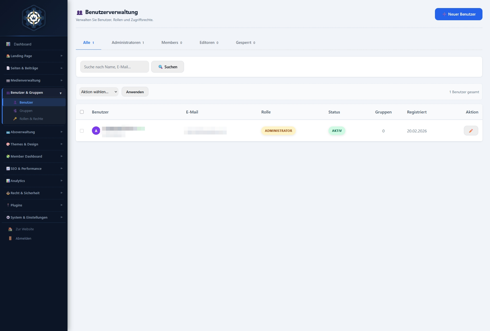
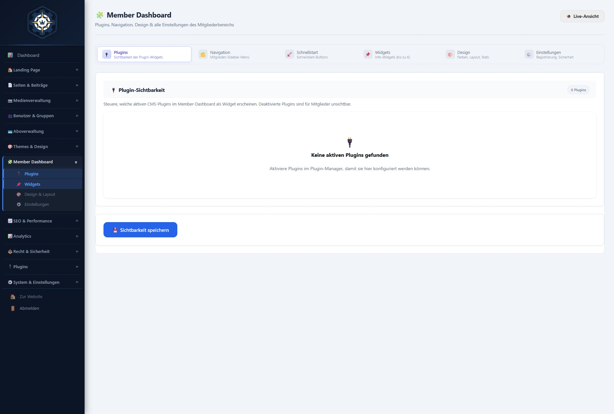
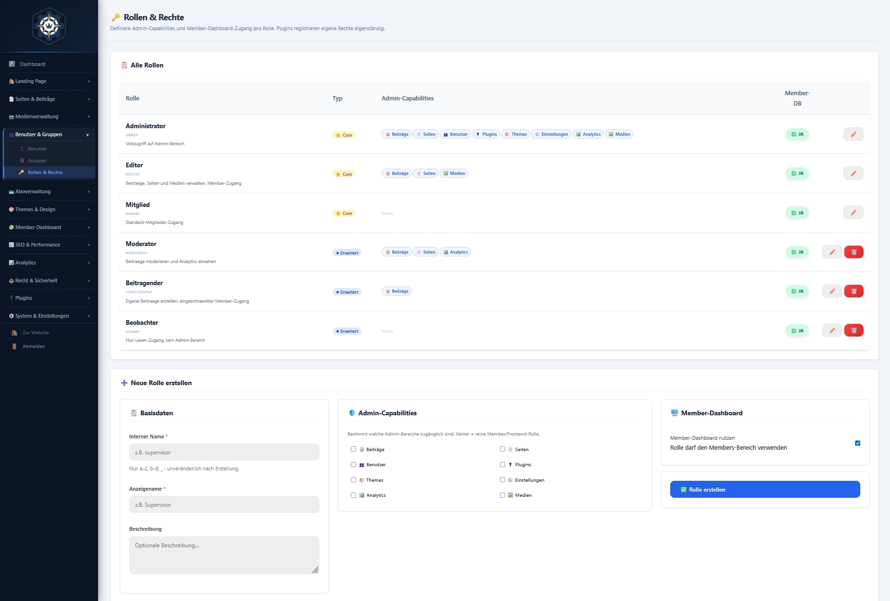
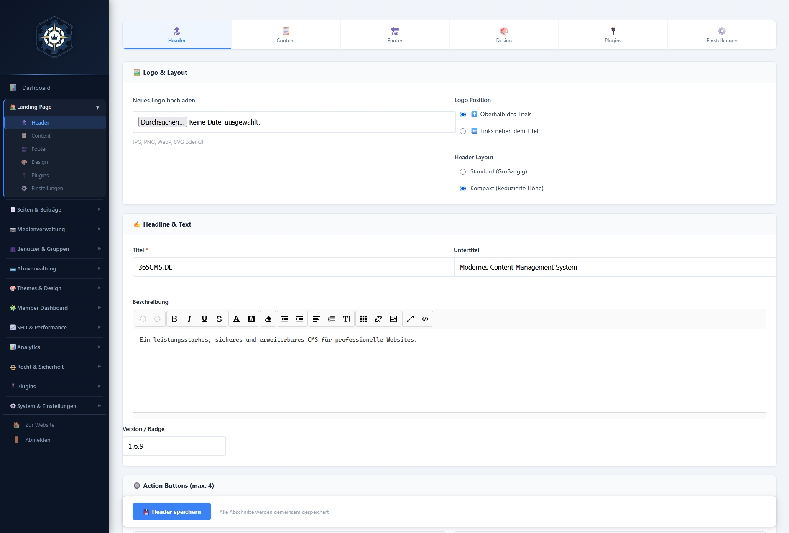
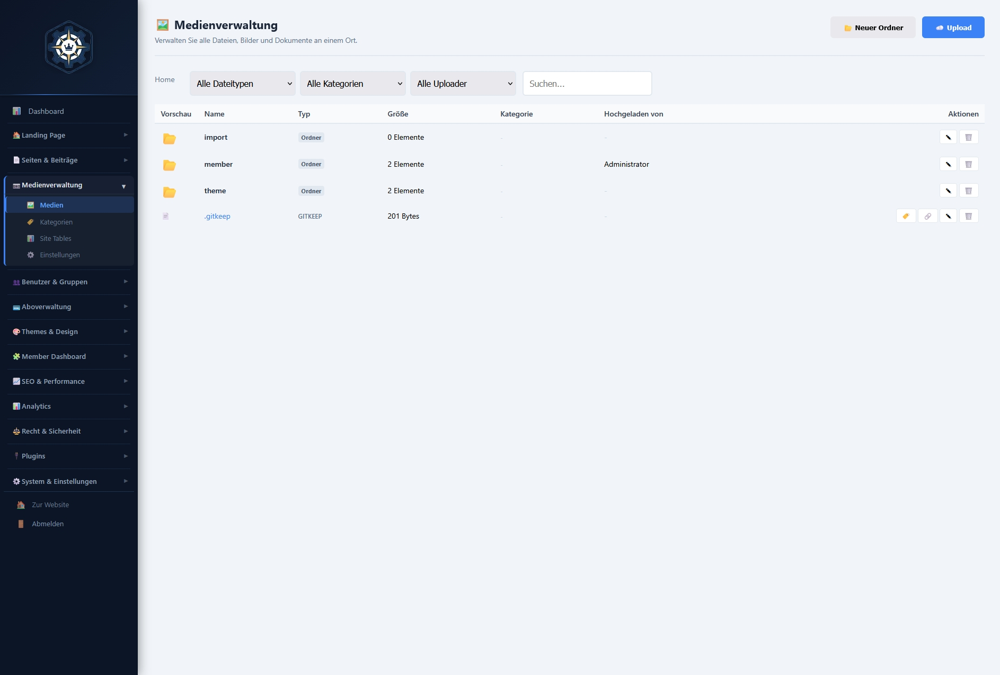
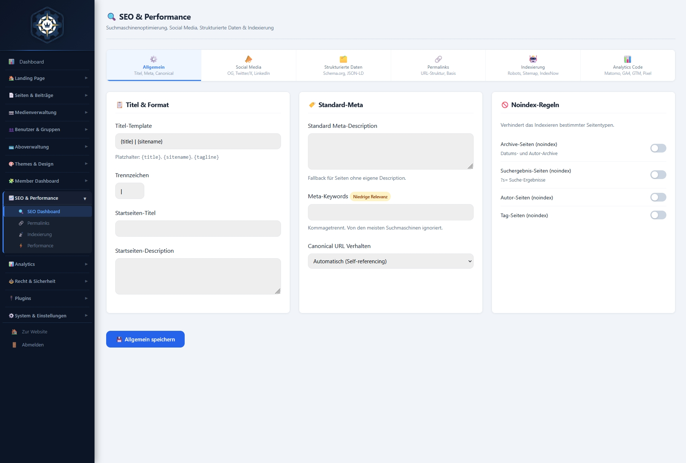
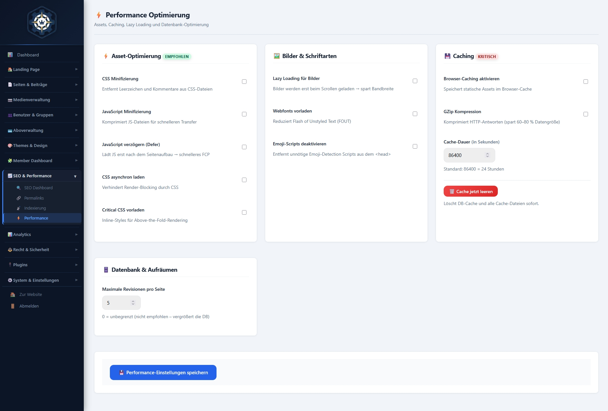
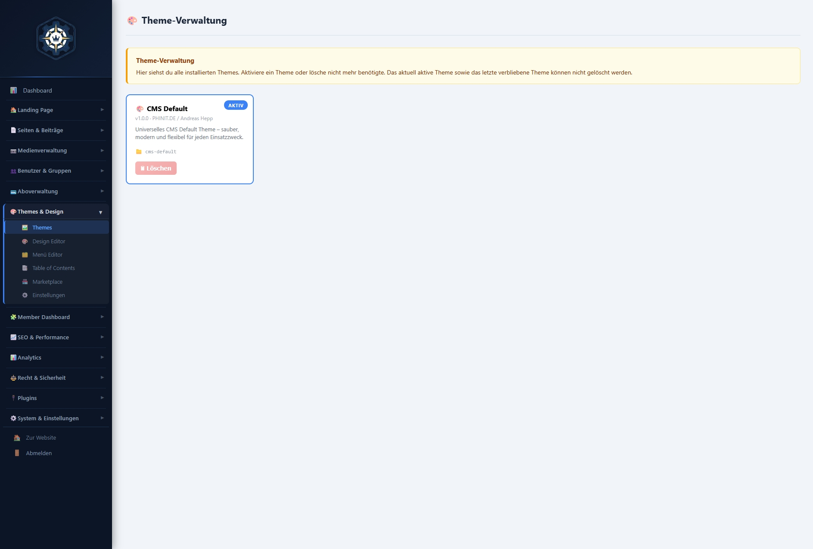
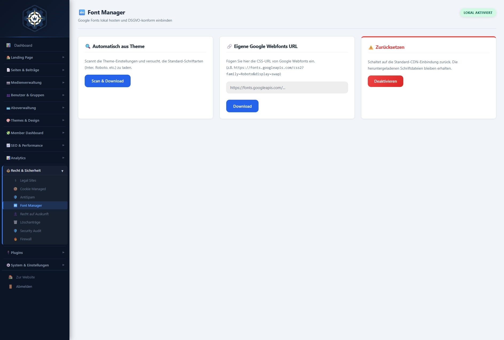

# 365CMS.DE  [](https://shields.io/)


---

### Sicheres, modulares und erweiterbares Content Management System
### [WWW.365CMS.DE](HTTPS://365CMS.DE)

## �️ Screenshots

### Dashboard & Übersicht


*Zentrales Admin-Dashboard mit Statistik-Cards, Schnellzugriff, System-Health und Aktivitäts-Feed.*

---

### Benutzerverwaltung & Rollen

| Benutzerverwaltung | Member-Dashboard |
|---|---|
|  |  |



*Granulare Rollen- und Rechteverwaltung (RBAC) mit 8 Capability-Checkboxen pro Gruppe.*

---

### Content Management

| Beiträge | Seiten |
|---|---|
|  |  |



*Visueller Landing-Page-Builder mit Sektions-Editor und Live-Vorschau.*

---

### Medien-Verwaltung



*Vollständige Media-Library mit Upload, Grid-/Listen-Ansicht, MIME-Filterung und Media-Proxy.*

---

### SEO & Performance

| SEO-Tools | Performance-Center |
|---|---|
|  |  |

---

### Theme & Design

| Theme-Verwaltung | Lokale Fonts |
|---|---|
|  |  |

---

### Abo-Verwaltung


*Subscription-Management mit Paket-Editor, Benutzer-Zuweisungen und Bestellverwaltung.*

---

### Sicherheit & DSGVO

| Firewall & Sicherheit | Cookie-Verwaltung |
|---|---|
|  |  |

---

### Einstellungen


*Globale Systemkonfiguration: Site-Einstellungen, Registrierung, E-Mail, Wartungsmodus und mehr.*

---

## 🚀 Features

### Core-System
- ✅ **Modulare Architektur** - OOP-Struktur mit Singleton-Pattern und PSR-4 Namespaces
- ✅ **Plugin-System** - WordPress-ähnliches Hook-System (Actions & Filters) für einfache Erweiterungen
- ✅ **Theme-System** - Flexibles Template-System mit Live-Customization und Theme-Marketplace
- ✅ **Theme-Editor** - Vollständiger visueller Theme-Customizer mit 50+ Optionen in 8 Kategorien
- ✅ **REST API** - Interne REST-API-Endpunkte für Frontend-Kommunikation
- ✅ **Sicherheit** - CSRF-Schutz, XSS-Prevention, Rate Limiting, Prepared Statements (PDO)
- ✅ **Performance** - Optimierte PDO-Abfragen, Query-Caching, CacheManager mit Auto-Clearing
- ✅ **Debug-System** - Strukturiertes Logging nach `/logs/debug-YYYY-MM-DD.log` (nur bei `CMS_DEBUG=true`)
- ✅ **Admin-Dashboard** - Vollständiges Backend mit KPI-Cards, Version-Badge und Schnellzugriff

### 👤 Benutzerverwaltung
- ✅ **Benutzer-Übersicht** - Stat-Cards (Gesamt, Aktiv, Admins, Mitglieder), Suche, Rollen-Filterung
- ✅ **Benutzer-Editor** - Erstellen, Bearbeiten, Passwort-Reset, Rollen- und Gruppen-Zuordnung
- ✅ **Bulk-Aktionen** - Massenoperationen: Aktivieren, Deaktivieren, Löschen
- ✅ **Gruppen-Verwaltung** - Eigene Benutzergruppen mit individuellen Paket-Zuweisungen
- ✅ **RBAC** - Role-Based Access Control mit 8 granularen Capabilities pro Gruppe
- ✅ **Member-Dashboard** - Admin-seitige Verwaltung aller Mitgliederbereiche
- ✅ **Login-Protokoll** - Vollständige Aufzeichnung aller Login-Ereignisse pro Benutzer

### 📝 Content Management
- ✅ **Seiten-Verwaltung** - WYSIWYG-Editor (SunEditor), SEO-Felder, Slug-Verwaltung, Revisionen
- ✅ **Blog/Beiträge** - Post-Management mit Kategorien, Tags, Featured Image, Publish-Workflow
- ✅ **Landing-Page-Builder** - Visueller Sektions-Editor mit Hero, Text, Bild, CTA-Blöcken
- ✅ **Inhaltsverzeichnis** - Automatische TOC-Generierung für lange Seiten
- ✅ **Menü-Verwaltung** - Drag-&-Drop Navigation mit mehrstufigen Menüs und Custom Links
- ✅ **Seiten-Tabellen** - Benutzerdefinierte Datentabellen mit CRUD, Import/Export (CSV/JSON)

### 🖼️ Medien-Bibliothek
- ✅ **Media-Upload** - Drag-&-Drop, MIME-Typ-Filterung, automatische Thumbnail-Generierung
- ✅ **Galerie-Ansicht** - Grid- und Listen-Layout mit Such- und Filteroptionen
- ✅ **Media-Proxy** - Sicheres Ausliefern von Medien über kontrollierten Proxy-Endpunkt
- ✅ **Datei-Verwaltung** - Umbenennen, Löschen, Metadaten-Bearbeitung (Alt-Text, Beschreibung)
- ✅ **Speicher-Statistiken** - Gesamtgröße, Dateianzahl, Typ-Aufschlüsselung

### 🔍 SEO & Analytics
- ✅ **Meta-Tags** - Global und seitenspezifisch: Title, Description, Keywords
- ✅ **Open Graph** - OG-Tags für Social-Media-Sharing (Facebook, Twitter/X)
- ✅ **Sitemap** - Automatisch generierte XML-Sitemap mit Ping an Suchmaschinen
- ✅ **Robots.txt** - Editierbares Robots.txt mit Vorlagen
- ✅ **Kanonische URLs** - Automatische Canonical-Link-Verwaltung
- ✅ **Analytics-Dashboard** - Besucherstatistiken, Seitenaufrufe, Top-Seiten, Referrer
- ✅ **System-Health** - Live-Monitoring von PHP, MySQL, Speicher, Cache-Status

### ⚡ Performance & Optimierung
- ✅ **Cache-Management** - Query-Cache, File-Cache, manuelle Cache-Invalidierung
- ✅ **Performance-Analyse** - Laufzeitmetriken, Slow-Query-Log, Ressourcen-Analyse
- ✅ **Asset-Optimierung** - CSS-Minifikation, JS-Minifikation, Font-Preloading
- ✅ **Lazy Loading** - Bilder und schwere Ressourcen werden verzögert geladen
- ✅ **Datenbank-Optimierung** - OPTIMIZE TABLE, REPAIR TABLE, Auto-Rebuild-Funktionen
- ✅ **Cache-Statistiken** - Hit-Rate, Miss-Rate, gespeicherter Speicher-Overhead

### 🎨 Theme-System
- ✅ **Theme-Marketplace** - Built-in Theme-Browser mit 10 fertigen Themes
- ✅ **Theme-Verwaltung** - Aktivieren, Deaktivieren, Vorschau, Theme-Details
- ✅ **Theme-Editor** - Vollständiger Code-Editor für Theme-Dateien (PHP, CSS, JS)
- ✅ **Theme-Customizer** - Live-Vorschau mit 50+ Einstellungen: Farben, Fonts, Layout, Header, Footer, Buttons
- ✅ **Theme-Einstellungen** - Pro-Theme-Konfigurationen (Logo, Favicon, Metadaten, Social Links)
- ✅ **CSS-Generator** - Automatische CSS-Generierung aus Customizer-Einstellungen
- ✅ **Import/Export** - Theme-Einstellungen als JSON sichern und teilen
- ✅ **Google Fonts** - 8+ integrierte Webfonts mit automatischem Lokal-Hosting
- ✅ **Lokale Fonts Manager** - Eigene Schriften hochladen, verwalten und in Themes einbinden
- ✅ **Custom CSS/JS** - Eigene Styles und Scripts pro Theme hinzufügen
- ✅ **Dark Mode Support** - Natives Dark-Mode-Handling in allen mitgelieferten Themes

### 🔌 Plugin-System
- ✅ **Plugin-Verwaltung** - Installieren, Aktivieren/Deaktivieren, Deinstallieren mit Bestätigung
- ✅ **Plugin-Marketplace** - Built-in Plugin-Browser mit Kategorien und Such-Filter
- ✅ **Plugin-Bibliothek** - cms-experts, cms-companies, cms-events, cms-speakers, cms-jobads, cms-importer
- ✅ **Auto-Updates** - Core-, Plugin- und Theme-Update-Prüfung via GitHub API
- ✅ **Hook-Integration** - Plugins erweitern Admin, Frontend und Member-Bereich via Hooks/Filters
- ✅ **Datenbank-Integration** - Plugins können eigene Tabellen erstellen und DB-Prefix nutzen

### 💳 Abo-Verwaltung
- ✅ **Paket-Verwaltung** - Abo-Pakete erstellen, bearbeiten, löschen mit Feature-Limits und Preis-Tiers
- ✅ **Abonnement-Einstellungen** - Abo-Toggle, Währung, Zahlungsmethoden, Bestellnummern-Format
- ✅ **Zuweisungen** - Benutzer-Abos und Gruppen-Pakete in einer Übersicht
- ✅ **Bestellverwaltung** - Vollständiges Order-Management mit Status-Tracking (Offen, Bestätigt, Storniert, Erstattet)
- ✅ **Checkout-System** - Member-seitiger Checkout mit Upgrade/Downgrade-Flow
- ✅ **Rechtliche Seiten** - Verknüpfung mit AGB, Datenschutz, Widerruf

### 🔒 Sicherheit & Firewall
- ✅ **CMS-Firewall** - IP-Blacklisting, Geo-Blocking, Request-Filterung, User-Agent-Blocking
- ✅ **AntiSpam** - Konfigurierbare Spam-Schutzregeln für Formulare und Kommentare
- ✅ **Security-Audit** - Automatisierter Sicherheits-Scan mit Score-System und Handlungsempfehlungen
- ✅ **Rate Limiting** - Konfigurierbare Anfragen-Limits pro IP für Login, API und Formulare
- ✅ **Failed-Login-Tracking** - Protokollierung fehlgeschlagener Anmeldungen, automatische IP-Sperre
- ✅ **Blockierte IPs** - Manuelle und automatische IP-Verwaltung mit Entsperr-Funktion
- ✅ **CSRF-Tokens** - Pflicht-Token für alle zustandsändernden Operationen
- ✅ **Session-Security** - HTTP-Only Cookies, Secure Flag, Session-Rotation
- ✅ **BCrypt Password Hashing** - Sichere Passwort-Speicherung mit automatischem Salt

### 🍪 DSGVO-Suite
- ✅ **Cookie-Verwaltung** - Cookie-Kategorien definieren (Notwendig, Analytics, Marketing), Dienstbibliothek
- ✅ **Consent-Management** - Dynamischer Zustimmungsstatus, Audit-Trail aller Einwilligungen
- ✅ **Cookie-Richtlinien-Generator** - Automatische Generierung der Cookie-Policy aus definierten Diensten
- ✅ **Datenzugriff (Art. 15 DSGVO)** - Automatisierte Datenauskunfts-Anfragen mit PDF-Export
- ✅ **Datenlöschung (Art. 17 DSGVO)** - DSGVO-konforme Löschanträge mit Workflow und Bestätigung
- ✅ **Rechtstexte** - Integrierter Generator für Impressum, Datenschutzerklärung, AGB, Widerrufsbelehrung
- ✅ **Legal-Sites Manager** - Verwaltung und Verknüpfung rechtlicher Pflichtseiten

### 👥 Member-Bereich
- ✅ **Profil** - Profilbearbeitung mit Avatar-Upload, Bio, Social Links, Sichtbarkeitseinstellungen
- ✅ **Nachrichten** - Privates Messaging-System mit Posteingang, Gesendeten und Benachrichtigungen
- ✅ **Benachrichtigungen** - System- und User-Notifications mit Echtzeit-Badge-Counter
- ✅ **Favoriten** - Beliebige Inhalte als Favoriten markieren und verwalten
- ✅ **Eigene Medien** - Persönliche Medienbibliothek verwalten und hochladen
- ✅ **Sicherheit** - Passwortänderung, Zwei-Faktor-Vorbereitung, vollständiges Login-Protokoll
- ✅ **Mitgliedschaft** - Abo-Übersicht, Upgrade/Downgrade, vollständiger Checkout-Flow
- ✅ **Support-System** - Integriertes Ticket-System mit Prioritäten, Status-Tracking und Admin-Kommunikation

### 🗄️ System & Diagnose
- ✅ **System-Info** - PHP-Version, MySQL-Version, aktive Extensions, Server-Konfiguration
- ✅ **Datenbank-Diagnose** - Tabellen-Status der 17 Kern-Tabellen, Datenbankgröße, Tabellen-Check
- ✅ **Dateisystem-Check** - Verzeichnis-Berechtigungen, Schreib-Tests, Disk-Space-Anzeige
- ✅ **Security-Status** - HTTPS-Prüfung, Security-Score, Failed-Logins der letzten 24h
- ✅ **Backup-System** - Datenbank- und Dateisystem-Backup, E-Mail-Versand, S3-Anbindung
- ✅ **Activity-Log** - Vollständige Aktivitätsverfolgung aller Admin-Aktionen
- ✅ **System-Tools** - Cache leeren, Sessions bereinigen, Tabellen reparieren/optimieren, Logs leeren
- ✅ **Update-Manager** - Core-, Plugin- und Theme-Updates direkt aus dem Backend

## 📋 Systemanforderungen

- **PHP:** 8.3+ (strict typing, return types)
- **MySQL:** 5.7+ / MariaDB 10.3+
- **Webserver:** Apache 2.4+ mit mod_rewrite
- **PHP Extensions:** PDO, PDO_MySQL, mbstring, JSON
- **Speicher:** Minimum 256MB RAM
- **Disk Space:** 100MB+ für CMS + Uploads

## 🔧 Installation

### 1. Dateien hochladen

Laden Sie alle Dateien in Ihr Webserver-Verzeichnis:
```bash
# Beispiel-Struktur
/var/www/html/365CMS/
# oder
C:/xampp/htdocs/365CMS/
```

**Wenn CMS in Unterverzeichnis:**
```apache
# In .htaccess
RewriteBase /365CMS/
```

**Für HTTPS-Redirect (Produktion):**
```apache
RewriteCond %{HTTPS} off
RewriteRule ^(.*)$ https://%{HTTP_HOST}%{REQUEST_URI} [L,R=301]
```

### Verzeichnis-Berechtigungen

```bash
# Linux/Mac
chmod 755 uploads/
chmod 755 cache/
chmod 755 logs/
chmod 644 config.php
chmod 644 .htaccess

# Oder via FTP
uploads/ → 755
cache/ → 755
logs/ → 755
config.php → 644
```

### Installation durchführen

1. **Browser öffnen:** `https://ihre-domain.de/install.php`
2. **Datenbank-Tabellen werden automatisch erstellt**
3. **Admin-User anlegen**
4. **Weiterleitung zum Dashboard**

### Erste Schritte (WICHTIG!)
✅ **install.php löschen:** Nach erfolgreicher Installation!

## 📁 Verzeichnisstruktur

```
365CMS/
├── core/                          # Kern-System (PSR-4)
│   ├── Bootstrap.php              # System-Initialisierung
│   ├── Database.php               # PDO-Wrapper mit prepared statements
│   ├── Security.php               # CSRF, XSS, Rate Limiting
│   ├── Auth.php                   # Authentifizierung & Sessions
│   ├── Router.php                 # URL-Routing
│   ├── Hooks.php                  # WordPress-like Hook-System
│   ├── PluginManager.php          # Plugin-Verwaltung
│   ├── ThemeManager.php           # Theme-Verwaltung
│   ├── PageManager.php            # Seiten-Management
│   ├── Api.php                    # REST API Endpoints
│   └── Services/                  # Service-Layer
│       ├── SystemService.php      # System-Diagnose
│       ├── ThemeCustomizer.php    # Theme-Anpassungen
│       └── LandingPageService.php # Landing-Page-Builder
├── admin/                         # Admin-Backend
│   ├── index.php                  # Dashboard
│   ├── users.php                  # Benutzerverwaltung
│   ├── groups.php                 # Gruppen & RBAC
│   ├── rbac.php                   # Rollen & Berechtigungen
│   ├── member-dashboard.php       # Member-Bereich Admin
│   ├── pages.php                  # Seiten-Verwaltung
│   ├── posts.php                  # Blog/Beiträge
│   ├── landing-page.php           # Landing-Page-Builder
│   ├── table-of-contents.php      # Inhaltsverzeichnis
│   ├── menus.php                  # Navigation & Menüs
│   ├── site-tables.php            # Benutzerdefinierte Tabellen
│   ├── media.php                  # Medien-Bibliothek
│   ├── seo.php                    # SEO-Einstellungen
│   ├── analytics.php              # Analytics & Statistiken
│   ├── performance.php            # Performance-Tools
│   ├── backup.php                 # Backup & Wiederherstellung
│   ├── themes.php                 # Theme-Verwaltung
│   ├── theme-editor.php           # Theme-Code-Editor
│   ├── theme-customizer.php       # Live-Customizer
│   ├── theme-settings.php         # Pro-Theme Einstellungen
│   ├── theme-marketplace.php      # Theme-Marketplace
│   ├── fonts-local.php            # Lokale Fonts Manager
│   ├── plugins.php                # Plugin-Verwaltung
│   ├── plugin-marketplace.php     # Plugin-Marketplace
│   ├── updates.php                # Update-Manager
│   ├── subscriptions.php          # Abo-Pakete & Zuweisungen
│   ├── subscription-settings.php  # Abo-Konfiguration
│   ├── orders.php                 # Bestellverwaltung
│   ├── legal-sites.php            # Rechtliche Pflichtseiten
│   ├── cookies.php                # Cookie-Verwaltung (DSGVO)
│   ├── data-access.php            # Datenzugriff (Art. 15 DSGVO)
│   ├── data-deletion.php          # Datenlöschung (Art. 17 DSGVO)
│   ├── antispam.php               # AntiSpam-Einstellungen
│   ├── cms-firewall.php           # CMS-Firewall & IP-Management
│   ├── security-audit.php         # Sicherheits-Audit
│   ├── support.php                # Support-Ticket-Verwaltung
│   ├── system.php                 # System & Diagnose
│   ├── settings.php               # Globale Einstellungen
│   ├── partials/
│   │   └── admin-menu.php         # Zentrale Sidebar-Definition
│   └── includes/                  # Admin-Hilfsfunktionen
├── member/                        # Mitgliederbereich
│   └── index.php                  # Member-Dashboard
├── themes/                        # Theme-Verzeichnis
│   ├── 365Network/                # Network-Theme
│   ├── academy365/                # Academy-Theme
│   ├── buildbase/                 # Builder-Theme
│   ├── business/                  # Business-Theme
│   ├── cms-default/               # Standard-Theme
│   ├── logilink/                  # Logistik-Theme
│   ├── medcarepro/                # Healthcare-Theme
│   ├── personalflow/              # HR-Theme
│   └── technexus/                 # Tech-Theme
├── plugins/                       # Plugin-Verzeichnis (CMS)
│   └── [plugin-name]/
│       └── [plugin-name].php      # Plugin-Hauptdatei
├── PLUGINS/                       # Externe Plugins
│   ├── cms-companies/             # Firmen-Verzeichnis-Plugin
│   ├── cms-events/                # Event-Management-Plugin
│   ├── cms-experts/               # Experten-Verzeichnis-Plugin
│   ├── cms-importer/              # Import/Export-Plugin
│   ├── cms-jobads/                # Stellenanzeigen-Plugin
│   └── cms-speakers/             # Referenten-Plugin
├── assets/                        # Statische Assets
│   ├── css/
│   │   ├── admin.css              # Admin-Styles (2000+ Zeilen)
│   │   └── admin-sidebar.css      # Sidebar-Styles
│   ├── js/
│   │   ├── admin.js               # Admin-JavaScript
│   │   └── theme.js               # Theme-JavaScript
│   └── images/                    # Statische Bilder
├── includes/                      # Helper-Funktionen
│   └── functions.php              # Globale Hilfsfunktionen
├── uploads/                       # User-Uploads
├── cache/                         # Cache-Verzeichnis
├── logs/                          # Log-Dateien (debug-YYYY-MM-DD.log)
├── config/                        # Konfigurationen
├── DOC/                           # Dokumentation
│   ├── screenshots/               # Admin-Screenshots
│   └── ...                        # Weitere Docs
├── index.php                      # Bootstrap-Datei
├── config.php                     # Konfiguration (gitignored!)
├── config.sample.php              # Config-Vorlage
├── install.php                    # Installations-Skript
├── media-proxy.php                # Media-Proxy Endpunkt
├── .htaccess                      # Apache-Konfiguration
└── README.md                      # Diese Datei
```

## 🎨 Theme-Editor verwenden

### Zugriff

Admin-Panel → **Theme Editor** (🎨 Icon)

### Verfügbare Kategorien

1. **Farben** - Vollständige Farbpalette (13 Optionen)
   - Primär-, Sekundär-, Erfolgs-, Warn-, Fehlerfarben
   - Hintergrundfarben (Hell, Mittel, Dunkel)
   - Textfarben (Primär, Sekundär, Hell)
   - Rahmenfarbe

2. **Typografie** - Schriften und Text (5 Optionen)
   - Basis-Schriftart (System + 8 Google Fonts)
   - Überschriften-Schriftart
   - Schriftgröße (12-20px)
   - Zeilenhöhe (1.2-2.0)
   - Font-Gewicht für Überschriften

3. **Layout** - Seitenlayout (6 Optionen)
   - Container-Breite (960-1600px)
   - Inhalts-Padding
   - Ecken-Radius (Border-Radius)
   - Sektions-Abstände
   - Sticky Header (Ein/Aus)
   - Back-to-Top Button (Ein/Aus)

4. **Header** - Header-Bereich (5 Optionen)
   - Hintergrundfarbe
   - Textfarbe
   - Header-Höhe (60-120px)
   - Logo Max-Höhe (30-80px)
   - Schatten Ein/Aus

5. **Footer** - Footer-Bereich (5 Optionen)
   - Hintergrundfarbe
   - Textfarbe
   - Link-Farbe
   - Footer-Widgets Ein/Aus
   - Spaltenanzahl (1-4)

6. **Buttons** - Button-Styling (5 Optionen)
   - Border-Radius
   - Padding (X/Y)
   - Schriftstärke
   - Text-Transformation

7. **Performance** - Optimierungen (3 Optionen)
   - Lazy Loading
   - CSS Minifikation
   - Font Preloading

8. **Erweitert** - Advanced Features
   - Custom CSS Editor
   - Custom JavaScript
   - Debug-Modus

### Workflow

1. **Kategorie wählen** - Tab anklicken
2. **Einstellungen anpassen** - Color Picker, Slider, Dropdown
3. **Speichern** - "Änderungen Speichern" Button
4. **CSS generieren** - Optional für Performance
5. **Exportieren** - Backup erstellen (JSON)

## 🔌 Plugin erstellen

### Basis-Struktur

```
plugins/
└── mein-plugin/
    └── mein-plugin.php
```

### Minimales Plugin

```php
<?php
/**
 * Plugin Name: Mein Plugin
 * Description: Plugin-Beschreibung
 * Version: 1.0.0
 * Author: Ihr Name
 */

declare(strict_types=1);

namespace MeinPlugin;

class MeinPlugin {
    private static ?self $instance = null;
    
    public static function instance(): self {
        if (self::$instance === null) {
            self::$instance = new self();
        }
        return self::$instance;
    }
    
    private function __construct() {
        $this->initHooks();
    }
    
    private function initHooks(): void {
        // Action Hooks
        \CMS\Hooks::addAction('cms_init', [$this, 'init'], 10);
        \CMS\Hooks::addAction('home_content', [$this, 'addContent'], 10);
        
        // Filter Hooks
        \CMS\Hooks::addFilter('template_name', [$this, 'modifyTemplate'], 10);
    }
    
    public function init(): void {
        // Plugin-Initialisierung
    }
    
    public function addContent(): void {
        echo '<div class="my-plugin-content">Plugin Content</div>';
    }
    
    public function modifyTemplate(string $template): string {
        return $template;
    }
}

// Plugin instanziieren
MeinPlugin::instance();
```

### Mit Datenbank-Tabellen

```php
private function createTables(): void {
    $db = \CMS\Database::instance();
    $pdo = $db->getConnection();
    $prefix = $db->getPrefix();
    
    $sql = "CREATE TABLE IF NOT EXISTS {$prefix}mein_plugin_data (
        id INT UNSIGNED AUTO_INCREMENT PRIMARY KEY,
        title VARCHAR(255) NOT NULL,
        content LONGTEXT,
        created_at TIMESTAMP DEFAULT CURRENT_TIMESTAMP,
        INDEX idx_title (title)
    ) ENGINE=InnoDB DEFAULT CHARSET=utf8mb4";
    
    $pdo->exec($sql);
}
```

### Verfügbare Hooks

**Core Actions:**
- `cms_init` - System initialisiert
- `cms_before_route` - Vor Routing
- `cms_after_route` - Nach Routing
- `theme_loaded` - Theme geladen
- `admin_init` - Admin-Bereich initialisiert
- `member_init` - Member-Bereich initialisiert

**Template Actions:**
- `head` - HTML `<head>` Bereich
- `body_start` - Nach `<body>` Tag
- `body_end` - Vor `</body>` Tag
- `before_header` - Vor Header
- `after_header` - Nach Header
- `before_footer` - Vor Footer
- `after_footer` - Nach Footer
- `main_nav` - Hauptnavigation
- `footer_sections` - Footer-Sektionen
- `home_content` - Homepage-Content

**Admin Actions:**
- `admin_menu` - Admin-Menü
- `admin_dashboard_content` - Dashboard-Content
- `admin_head` - Admin `<head>`

**Filter Hooks:**
- `template_name` - Template-Name ändern
- `page_content` - Seiten-Content modifizieren
- `theme_color_*` - Theme-Farben anpassen
- `admin_menu_items` - Admin-Menü erweitern

Vollständige Hook-Referenz: [doc/HOOKS-REFERENCE.md](doc/HOOKS-REFERENCE.md)

## 🔒 Sicherheit

- ✅ **CSRF Protection:** Token-basiert für alle State-Changes
- ✅ **XSS Prevention:** Input-Sanitization + Output-Escaping
- ✅ **SQL Injection Prevention:** Prepared Statements (PDO)
- ✅ **Rate Limiting:** Login-Versuche, API-Calls
- ✅ **Password Hashing:** BCrypt mit Salt
- ✅ **Session Security:** HTTP-Only Cookies, Secure Flag
- ✅ **Input Validation:** Type-safe mit PHP 8.3
- ✅ **Failed Login Tracking:** Automatische IP-Blockierung
- ✅ **Activity Logging:** Vollständige Audit-Trails

## 🛠️ Entwicklung

### Debug-Modus

```php
// config.php
define('CMS_DEBUG', true);
```

**Zeigt:**
- PHP-Fehler und Warnings
- SQL-Queries mit Ausführungszeit
- Hook-Aufrufe
- Plugin-Loading-Reihenfolge

### Helper-Funktionen

```php
// Ausgabe escapen
echo esc_html($text);
echo esc_url($url);
echo esc_attr($attribute);

// Sanitization
$clean = sanitize_text($input);
$email = sanitize_email($email);

// Optionen
$value = get_option('key', 'default');
update_option('key', $value);

// User-Checks
if (is_logged_in()) { }
if (is_admin()) { }
$user = current_user();

// Theme-Customizer
$color = theme_get_setting('colors', 'primary_color');
$fonts = get_theme_customizer()->getCategory('typography');

// Debug
dd($variable); // Dump & Die (nur mit CMS_DEBUG)
```

### System-Anforderungen prüfen

Admin → **System & Diagnose**

**Übersicht:**
- PHP-Version, MySQL-Version
- Datenbank-Verbindung
- Speicher-Nutzung
- Aktive Sessions

**Datenbank:**
- Tabellen-Status (17 Kern-Tabellen)
- Datenbank-Größe
- Tabellen-Checks

**Dateisystem:**
- Verzeichnis-Berechtigungen
- Schreib-Tests
- Disk-Space

**Sicherheit:**
- HTTPS-Status
- Failed Logins (24h)
- Security-Score

**Tools:**
- Cache leeren
- Alte Sessions löschen
- Tabellen reparieren/optimieren
- Logs leeren
- Fehlende Tabellen erstellen

## 🆘 Troubleshooting

### Weißer Bildschirm (WSOD)

```bash
# PHP-Fehlerlog prüfen
tail -f /var/log/apache2/error.log

# In config.php
define('CMS_DEBUG', true);
```

**Häufige Ursachen:**
- PHP-Version < 8.3
- Fehlende PDO Extension
- Datenbank-Verbindungsfehler
- Syntax-Fehler in config.php

### Plugins werden nicht geladen

```bash
# Berechtigungen prüfen
ls -la plugins/

# Sollte sein:
drwxr-xr-x plugins/
-rw-r--r-- plugin-name/plugin-name.php
```

**Checkliste:**
- Plugin-Dateiname = Verzeichnisname
- Plugin-Header korrekt (siehe Beispiel oben)
- Keine PHP-Syntax-Fehler
- Namespace korrekt deklariert

### 404-Fehler bei allen Seiten

**Apache:**
```bash
# mod_rewrite aktiviert?
a2enmod rewrite
systemctl restart apache2
```

**.htaccess:**
```apache
# RewriteBase korrekt?
RewriteBase /    # Für Root
RewriteBase /365CMS/    # Für Unterverzeichnis
```

**Nginx:**
```nginx
location / {
    try_files $uri $uri/ /index.php?$args;
}
```

### Theme-Editor Tabs funktionieren nicht

**Browser-Konsole öffnen:**
- F12 → Console Tab
- Auf JavaScript-Fehler prüfen

**Cache leeren:**
- Browser-Cache: Strg+Shift+R
- CMS-Cache: Admin → System → Cache leeren

### Datenbank-Fehler

```sql
-- Manuell Tabellen prüfen
SHOW TABLES LIKE 'cms_%';

-- Oder via Admin:
Admin → System & Diagnose → Tools → Fehlende Tabellen erstellen
```

## 📊 Datenbank-Schema

### Kern-Tabellen

| Tabelle | Beschreibung |
|---------|--------------|
| `cms_users` | Benutzer-Accounts |
| `cms_user_meta` | Erweiterte User-Metadaten |
| `cms_roles` | Rollen & Berechtigungen |
| `cms_groups` | Benutzergruppen |
| `cms_sessions` | Aktive Sessions |
| `cms_settings` | Globale Systemeinstellungen |
| `cms_pages` | Seiten-Content |
| `cms_page_revisions` | Seiten-Revisionen |
| `cms_posts` | Blog-Beiträge |
| `cms_post_categories` | Beitrags-Kategorien |
| `cms_post_tags` | Beitrags-Tags |
| `cms_landing_sections` | Landing-Page Sektionen |
| `cms_menus` | Navigationsmenüs |
| `cms_menu_items` | Menü-Einträge |
| `cms_media` | Media-Library |
| `cms_activity_log` | Aktivitäts-Audit-Log |
| `cms_cache` | Query-Cache |
| `cms_failed_logins` | Fehlgeschlagene Logins |
| `cms_login_attempts` | Login-Versuche |
| `cms_blocked_ips` | IP-Sperrliste (Firewall) |
| `cms_plugins` | Installierte Plugins |
| `cms_plugin_meta` | Plugin-Metadaten |
| `cms_theme_customizations` | Theme-Customizer-Einstellungen |
| `cms_subscriptions` | Abo-Pakete |
| `cms_user_subscriptions` | Benutzer-Abonnements |
| `cms_orders` | Bestellungen |
| `cms_cookies` | Cookie-Definitionen (DSGVO) |
| `cms_cookie_consents` | Cookie-Einwilligungen |
| `cms_support_tickets` | Support-Tickets |
| `cms_support_messages` | Ticket-Nachrichten |
| `cms_notifications` | Benutzer-Benachrichtigungen |
| `cms_messages` | Private Nachrichten |
| `cms_site_tables` | Benutzerdefinierte Datentabellen |

Vollständiges Schema: [DOC/](DOC/)

## 📚 Weitere Dokumentation

- **[Installations-Guide](DOC/INSTALLATION.md)** - Detaillierte Installations-Anleitung
- **[Admin-Guide](DOC/admin/)** - Vollständige Admin-Panel-Dokumentation
- **[API-Referenz](DOC/core/)** - REST API Endpunkte
- **[Feature-Dokumentation](DOC/feature/)** - Alle Features im Detail
- **[Plugin-Entwicklung](DOC/plugins/)** - Plugin-Entwicklungs-Guide
- **[Theme-Entwicklung](DOC/theme/)** - Theme-Entwicklungs-Guide
- **[Member-Bereich](DOC/member/)** - Member-Dokumentation
- **[Workflow-Guides](DOC/workflow/)** - Arbeitsabläufe und Best Practices
- **[Changelog](Changelog.md)** - Vollständige Versions-Historie

## 🔄 Versions-Historie

> Die vollständige Versionshistorie mit allen Einzel-Patches befindet sich im [Changelog](Changelog.md).

### v1.8.x (22. Februar 2026) — **AKTUELL** · Security & Firewall Suite
- ✅ CMS-Firewall mit IP-Blocking, Geo-Filtering und Request-Analyse
- ✅ AntiSpam-System mit konfigurierbaren Schutzregeln
- ✅ Security-Audit-Seite mit automatisiertem Score und Handlungsempfehlungen
- ✅ RBAC-Verwaltung vollständig überarbeitet
- ✅ Support-Ticket-System im Admin-Bereich integriert

### v1.7.x (22. Februar 2026) — Theme & Plugin Marketplace
- ✅ Theme-Marketplace mit 10 fertigen Themes
- ✅ Plugin-Marketplace mit Kategorie-Browser und Such-Filter
- ✅ Lokale Fonts Manager mit Upload und Theme-Integration
- ✅ Theme-Customizer Live-Vorschau erweitert (50+ Optionen)
- ✅ Update-Manager für Core, Plugins und Themes via GitHub API

### v1.6.x (21.–22. Februar 2026) — Cookie-Manager & Legal-Suite
- ✅ Cookie-Verwaltung mit Dienstbibliothek und Sicherheitsprüfungen
- ✅ AntiSpam-Einstellungsseite und Rechtstexte-Generator
- ✅ Cookie-Richtlinie-Generierung und dynamischer Zustimmungsstatus
- ✅ Site-Tables-Management mit CRUD-Operationen und Import/Export
- ✅ Cache-Clearing und Asset-Regenerierung

### v1.5.x (21. Februar 2026) — Support-System & DSGVO
- ✅ DSGVO-konforme Datenlöschung (Art. 17) und Security-Audit-Seite
- ✅ Support-Ticket-System mit Prioritäten und Status-Tracking
- ✅ Datenzugriffs-Anträge (Art. 15 DSGVO) automatisiert
- ✅ Debug-Logging nur noch bei `CMS_DEBUG=true`

### v1.4.x (21. Februar 2026) — Admin-Erweiterungen
- ✅ Plugin- und Theme-Marketplace-Seiten
- ✅ Aboverwaltung: Pakete-Editor, Zuweisungen, Einstellungen-Tab
- ✅ Version-Badge im Admin Dashboard
- ✅ Dokumentationsabruf mit rekursivem Directory-Traversal

### v1.3.x (20. Februar 2026) — 🚀 First Public Release
- ✅ **365CMS.DE öffentlich veröffentlicht**
- ✅ Subscription- und Checkout-System
- ✅ Blog-Routen und Datenbankschema v3
- ✅ Landing-Page-Builder, Menü-Verwaltung, Media-Library

## 👨‍💻 Support & Community

- **Issue Tracker:** GitHub Issues
- **Email:** info@phinit.de

## 🙏 Credits

- **Entwicklung:** Andreas Hepp
- **Website:** PhinIT.DE & 365CMS.DE
- **Icons:** Dashicons
- **Fonts:** Google Fonts with Local Font Manager
- **Editor:** Suneditor is based on pure JavaScript, no dependencies. 
- **Inspiration:** WordPress, Laravel, Symfony

---

## Lizenz

Freie Verwendung für private und geschäftliche Projekte **mit Copyright-Hinweis**.

Nutzung **ohne Copyright-Hinweis** ist kostenpflichtig (Privat: einmalig 50,00 € · Geschäftlich: Preis auf Anfrage).